# Java-Grundlagen
## Bespiel eines Java-Programms

```java
package Examples;
import java.util.Scanner;
//import java.io.*

public class Echo { //oder interface
	public static void main(String[] args){
		Scanner scanner=new Scanner(System.in);
		String s=scanner.next();
		System.out.println(s); 
      scanner.close()
	}
}
//Standardstream Objekte:
//System.in – Standardeingabe
//System.out – Standardausgabe
//System.err - Standardfehlerausgabe
```

Paket: Sammlung semantisch zusammengehöriger Klassen in einem Verzeichnis

Klasse: Spezifikation von gleichartigen Objekten, gekennzeichnet durch gleiche Eigenschaften (Attribute) und gleiches Verhalten (Methoden)

Interface: Schnittstelle, festgelegt durch Methodendeklaration

```java
//Klassen und Interfaces

public class Point {
	//…
}

public interface IDrawable {
	//…
}

public class Line extends Point implements IDrawable{
	//…
}

public interface I3DDrawable extends IDrawable {
	//…
}
```

### Kapselung

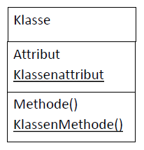

Kapselung - Verbergen oder Schützen von Daten vor dem unmittelbaren Zugriff von außen. Der Zugriff erfolgt stattdessen über definierte Schnittstellen.

```java
public class Animal {
   private String name;

   public void say(){
   	System.out.println(name+": frgdrf!"); 
   }

   public String getName(){
	return name;
   }

   public void setName(String name){
	this.name=name;
   }
}
```

### Klassen und Objekte

Klasse (Objekttyp): ein abstraktes Modell bzw. ein Bauplan für eine Reihe von ähnlichen Objekten (s. wikipedia)

Objekt: Exemplar eines bestimmen Typs, konkrete Ausprägung, wird erzeugt zur Laufzeit

```java
Animal animal1=new Animal();
animal1.setName("Max"); animal1.say();
```

```java
public class Animal {
   private String name;
   public void say(){
   	System.out.println(name+": frgdrf!"); 
   }
   public Animal(){
   	name="unknown"; 
	//name = null;
   }
   public Animal(String name){
   	this.name=name;
   }
   public String getName(){
	return name;
   }
   public void setName(String name){
	this.name=name;
   }
}
```

```java
Animal animal1=new Animal();
Animal animal2=new Animal("Auguste");
animal1.say();
animal2.say();
```

- Konstruktoren
- generierter Standart-Konstruktor initialisiert auf null, 0, false
- spezielle Referenzen: null, this, super
  
### Variabledefinition

```java
Animal animal1;
animal1 = new Animal
int i; //es wird Datenelement angelegt, nicht nur Referenz
static int a=123;
long b=123L;
```

Referenzvariablen: new, Heap und Gabrage Collector

Garbage Collection GC Müllabfuhr)Müllabfuhr): automatische Speicherverwaltung (Bereinigung)

Zur Laufzeit werden nicht benötigte (nicht referenzierte) Variablen automatisch identifiziert
und freigegeben

Vorteil gegenüber manueller Speicherverwaltung: Vermeidung von Speicherproblemen (Speicherlecks)

Nachteil: erhöhter Ressourcenverbrauch (wegen Verzögerung)

Lokale Variablen, Methodenparameter: Stack

### Mitglieder der Klasse (Definition, Initialisierung, Zugriffsrechte)

**Attribut**:

private String name="Bosch", vorname="Hieronymus";

**Methode**:

public void say(){
   System.out.println("You say goodbye and I say hello"); 
}

**Modifizierer**

| Modifizierer | Klasse | Attribut | Methode | Konstruktor |
| --------------- | ---- | ---- | ---- | ----------- |
| public | x (sonst package) | x | x | x |
| protected |   | x | x | x |
| private |   | x| x | x |
| static |   | x | x |   |
| final | x (nur initialisierbar) | x (nicht überschreibar) | x (nicht überschreibar) |   |
| abstract | x |   | x |   |

### Vererbung (Generalisierun)

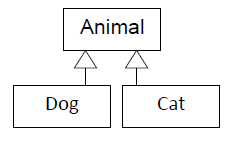

```java
public class Dog extends Animal{
   private String breed;
   public Dog(){
      super(); breed="mongrel"; 
   }
   public Dog(String name, String breed){
      super(name);
   this.breed=breed;
   }
   @Override
   public void say(){
   super.say();
   System.out.print("I'm "+breed+", Waff waff!"); 
   }	
}
public class Cat extends Animal{ 
//…
   public void say(){
      System.out.println("Miau miau?"); 
}

Dog dog=new Dog("Trixi","Mops");
Cat cat=new Cat(…);
dog.say();
cat.say();
 
```

### Polymorphie: Vielgestaltigkeit

- Klassen: Referenzen der Basisklasse können Objekte der abgeleiteten Klassen zugewiesen bekommen

- Methoden: gleiche Namen, verschiedene Implementierungen
  
```java
Animal dog=new Dog("Trixi","Mops");
Animal cat=new Cat(…);
dog.say();
cat.say();
```
Methode werden standardmäßig dynamisch aufgelöst (Late Binding)

nicht virtuell:

- static - werden zur Compile-Zeit aufgelöst (Early Binding) und 
- private - nicht überschreibar

### Abstrakte Klassen und Methoden

```java
abstract class Animal {
    private String name;

    public abstract String void say();

    public Animal(){
   name="unknown";
    }

    public Animal(String name){
   this.name=name;
    }
}

Animal animal2=new Animal("August"); //geht nicht
Animal dog=new Dog("Trixi","Mops");
Animal cat=new Cat(…);
dog.say();
cat.say();
```

- Ist eine Methode abstract, so muss die Klasse ebenfalls abstract sein.
- Ist eine Klasse abstract, so kann von dieser Klasse kein Objekt erzeugt werden.

### static- Variablen und -Methoden

Klassenvariablen (Methoden) 
sind nicht den Objekten zugeordnet, sondern gehören zur Klasse selbst und stehen in allen Instanzen gleichermaßen zur Verfügung

```java
public final class EineKlasse { 
   //... 
   public static final double PI = 3.14159265358979323846; 
   //... 
   } 
   public static void print() { 
       System.out.println(PI);
   }
}

public class AndereKlasse { 
  public static void main(String[] args) {
     System.out.println(EineKlasse.PI);
     EineKlasse.print();
  } 
} 
```

### Klasse Object

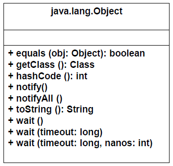

```java
Scanner sc=new Scanner(System.in);
System.out.println(sc.getClass());

liefert 
   class java.util.Scanner

System.out.println(sc.toString());

liefert
   java.util.Scanner[delimiters=\p{javaWhitespace…
```

Methoden überschreiben

```java
public class Animal {
    String name;
    @Override
    public String toString() {
        return "Animal [name=" + name + "]";
    }
    @Override
    public int hashCode() {
       int result = 31;
       result = result + ((name == null) ? 0 : name.hashCode());
       return result;
    }
    @Override
    public boolean equals(Object obj) {
       if (this == obj) return true;
       if (obj == null) return false;
       if (this.getClass() != obj.getClass()) return false;
       Animal other = (Animal) obj; 
       return name.equals(other.name);
   }
}
```

### Innere Klassen

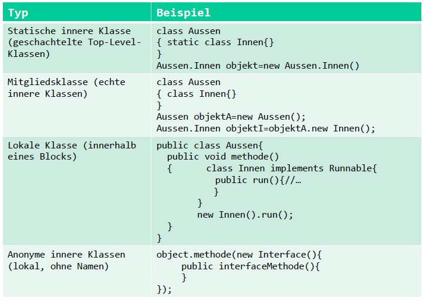

### Interface

- ermöglicht Mehrfachvererbung
- stellt Methode (sehr selten Konstanten) zur Verfügung, die von Klassen implementiert werden und zwar alle Methoden
- Methoden sind implizit public (öffentlich) und abstract

```java
public interface IDrawable {
   void draw();
}

public class Line extends Point implements IDrawable{
   @Override
   public void draw(){
   /*…*/
   }
}
```

### SAM (Single Abstract Method)

- Schnittstelle oder abstrakte Klasse, die genau eine abstrakte Methode definiert
- stellt eine spezielle Funktionalität bereit, ohne dass mehrere Methoden überschrieben werden müssen
- Implementierung ab Java 8 über Lambda-Ausdrücke möglich
- Schnittstellen mit nur einer abstrakten Methode werden auch als Funktionale Schnittstellen bezeichnet

```java
public interface Runnable {
    void run();
}

public class Thread implements Runnable{
   @Override
   public void run(){
  }
}
```

```java
@FunctionalInterface
interface MyFI {
    void performTask();
}

MyFI task = () -> System.out.println("Task performed!");
task.performTask(); 
```
### Annotationen

- sind häufig optional (@Override, @FunctionalInterface, @Deprecated, @SuppressWarning)
- wenn sie verwendet werden, überprüft der Compiler die Korrektheit – Kompilierzeit-Annotationen
- Laufzeit-Annotationen (@Autowired) werden zur Laufzeit benötigt, um das erwartete Verhalten zu gewährleisten – können nicht weg gelassen werden
- Dokumentations-Annotationen (@Deprecated) 

### Char, Character (java.lang.Character) und String (StringBuffer, StringBuilder)

- Unicode universelles Zeichencodierungssystem: jedes Zeichen der Welt eindeutig kodierbar (120 000 Zeichen)
- JVM (Java, Kotlin), JavaScript: intern werden Strings mit UTF-16 (Unicode Transformation Format) dargestellt
- Zum Übertragen der Texte (z.B. über Sockets) wird üblicherweise UTF-8 verwendet
- String ist unveränderbar, threadsicher ( s[0]='A' geht nicht! ), StringBuffer und StringBuilder sind veränderbar

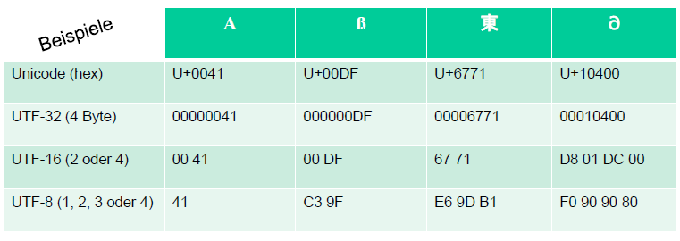

Quelle: http://openbook.rheinwerk-verlag.de/javainsel/04_001.html

### Ausnahmebehandlung

was passiert wenn:

```java
stringToConvert = "1A";// "1"
int nummer = Integer.parseInt( stringToConvert );


java.lang.NumberFormatException: For input string: "1A"
at java.lang.NumberFormatException.forInputString(Unknown Source)
at java.lang.Integer.parseInt(Unknown Source)
at java.lang.Integer.parseInt(Unknown Source)
at StrMan.main(StrMan.java:64)
```

> Ausnahme (Exception) – ein nicht geplantes Ereignis, das zum Programmabsturz führt

wie läuft das ab:

```java
stringToConvert = "1A";
try {
   nummer = Integer.parseInt( stringToConvert );
}
catch ( NumberFormatException e ){
   System.err.printf( "'%s' kann man nicht in eine Zahl konvertieren!%n", stringToConvert );
   nummer=0;
}
System.out.println( "Weiter geht's" );
```

wäre nicht if-Anweisung einfacher?

> Ausnahmebehandlung - Trennung zwischen dem Sollverhalten und der Ausnahmesituation 

try-catch-Anweisung 

```java
try { Anweisungen }
catch ( Ausnahme oa1 ) {Anweisungen bei Ausnahme oa1}
catch ( Ausnahme oa2 ) {Anweisungen bei Ausnahme oa2}
:
catch ( Ausnahme oan ) {Anweisungen bei Ausnahme oan}
[finally { Anweisungen als abschließende Maßnahmen }]
```

Immer geht: catch (Exception  e){}

finally 
dient zum Durchführen abschließenden Maßnahmen, z.B. Objekte sichern, Dateien schließen

wird immer ausgeführt, in allen 3 Fällen:

- Es gab keine Ausnahme!
- Es gab eine Ausnahme und diese wurde in einer catch-Anweisung behandelt!
- Es gab eine Ausnahme, aber keine catch-Anweisung war für diesen Fehler zuständig!

Klassenhierarchie (winziger Auszug):

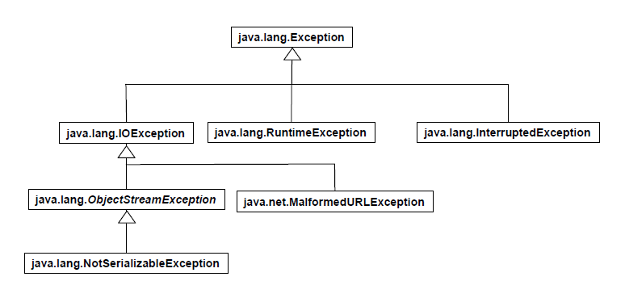

**Exception** – Basisklasse für alle Exception

**Throwable** – Basisklasse für Objekte, die Ausnahmesituationen (Errors und Exception) signalisieren

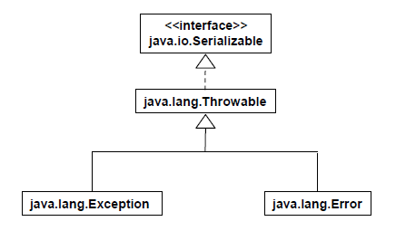

Throwable-Methoden:

- String getMessage()
- void printStackTrace()

Ist die Ausnahmenbehandlung immer sinnvoll?
Und was ist eine Ausnahme und was ist ein Fehler?

**Error** – nicht reparierbar Laufzeitfehler von JVM oder Hardware verursacht (OutOfMemoryError, StackOverflowError, InternalError)

java.lang.Error in der Anwendung praktisch nicht behandelbar bzw. die Behandlung ist sinnlos, 

Ausnahme: Protokollierung, Durchführung von Notfallaktionen

**Exception** – kein Fehler, unerwarteter Fall zur Laufzeit

IOException, InterruptedException sinnvoll behandelbar

RuntimeException – möglicherweise Programmierfehler

RuntimeException-Beispiele:

− Fehler beim Parsen (NumberFormatException)
− Division durch 0 (ArithmeticException)
− Grenzüberschreitung bei Array (IndexOutOfBoundsException)
− Objekt existiert nicht (NullPointerException)

```java
public class Ausnahmen {
//…
public void methode(Klasse objekt) {
  try{
   Point p = objekt.getPoint(); 
          //objekt kann null sein
          //bzw. null liefern
      //wäre aber auch mit if-Anweisung auszuschließen
   p.setX(20);
   //…
  }
  catch(java.lang.NullPointerException e){
   System.err.println(e);
  } 
 }
}
```

Aber muss die Methode alles selbst behandeln?

Nein, sie kann Exception an die aufzurufende Methode weiter leiten!

```java
public class Ausnahmen {
//…
public void methode(Klasse objekt) 
      throws NullPointerException {
   Point p = objekt.getPoint(); 
   p.setX(20);
   //… 
  }
}

public static void main(String args []){
   try{
        new Ausnahmen().methode();
   }
   catch(java.lang.NullPointerException e){
        System.err.println(e);
   } 
}
```

Ausnahmeobjekt „manuell“ auswerfen: throw objekt 

```java
public class AusnahmeRaus {
public void methode() throws NullPointerException{
   //…
   throw new NullPointerException();
  }
}

public class AusnahmeRein {
public static void main(String[] args) {
   AusnahmeRaus o = new AusnahmeRaus();
   try{
      o.methode();
   }
   catch(NullPointerException e){
      e.printStackTrace(System.err);
   }
  }
}
```

Und wenn es keine passende Exception gibt?

Jeder Zeit ist die Definition eigener Exception möglich, abgeleitet von Exception oder einer anderen passenden Klasse

```java
public class EinfachLeer extends Exception{
 //…
}

public class AusnahmeRaus {
   private String beutel;
   public void methode() throws EinfachLeer {
     if (beutel.isEmpty()) throw new EinfachLeer();
     //…
   }
}
```

## Ein- und Ausgabe

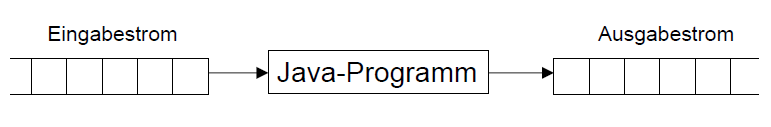

Ein-, Ausgabemodell:

- basiert auf Datenströmen 
- Daten: Texte, html-Code, pdf-, mp3-Dateien, …

Datenarten:

- Zeichen (char) – Reader, Writer
- Binärdaten (byte) – InputStream, Outputstream

### Reader

java.io.*

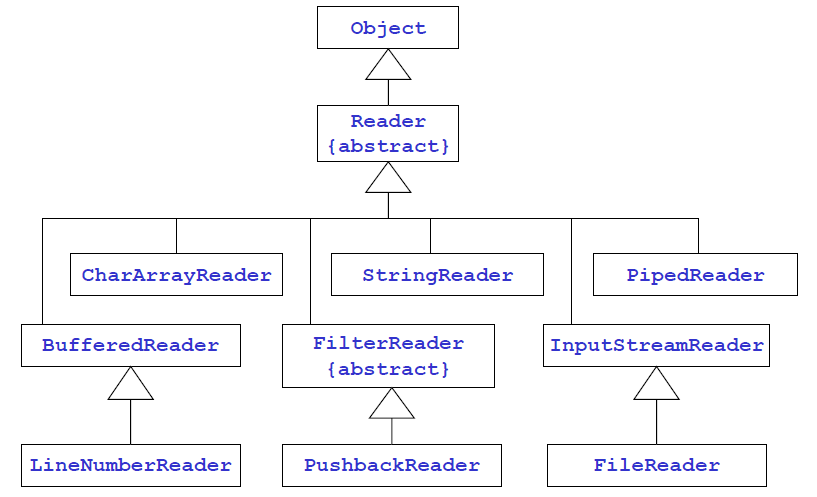
Quelle: Prof. B. Steinbach, Vorlesung „Verteilte Software“

### Dekorator Muster (decorator pattern)

- eine Möglichkeit die Klasse um die zusätzlichen Funktionalität zu erweitern
- Strukturmuster
- Instanz des Dekorierers wird vor der Instanz zu dekorierenden Klasse geschaltet:
  
  `BufferedReader br=new BufferedReader (new InputStreamReader(System.in));`

- beide haben die gleiche Schnittstelle (Methode, z.B. read, write)
  `int zeichen=br.read();`
 
- Aufrufe werden vom Dekorierer an Dekorierten weitergeleitet

### Klasse java.lang.System

static-Objekte der Klassen InputStream, PrintStream:

```
Standardeingabe	in
Standardausgabe	out
Standardfehlerausgabe 	err

BufferedReader br=new BufferedReader(new InputStreamReader(System.in));
Scanner sc=new Scanner(System.in);
System.out.println("Ausgabe");
```

### Klasse Scanner (java.util.Scanner)

- Zerlegung von Sources in Token, Einlesen Token-weise
- ableleitet von `java.util.Iterator<E>`
- erbt
   `hasNext(): boolean`, 
   `next(): E`, 
   `remove()` 
- definiert viele weitere Methoden: `nextInt()` etc
- Konstruktoren: 
   `Scanner(File source)`,
   `Scanner(InputStream source)`,
   `Scanner(String source)`

Beispiele:

```java
String text = "Hänsel-und-Gretel\ngingen-durch-den-Wald";

Scanner scanner = new Scanner( text ).useDelimiter( "-" );

//lesen einer datei zeilenweise
import java.io.*;
import java.util.Scanner;
public class ReadAllLines{
   public static void main( String[] args )  throws FileNotFoundException  {
      Scanner scanner = new Scanner( new File("quelle.txt") );
      while ( scanner.hasNextLine() )
         System.out.println( scanner.nextLine() );
      scanner.close();
    }
 }
```

### InputStream, Reader, OutputStream

```java
int read()
int read(byte[] buf)
int read(byte[] buf, int off, int len) 
void close()
void write(int b) 
void write(byte[] b) 
void write(byte[] b, int off, int len)
void flush() 
void close()
```

- Rückgabe -1, falls das Ende des Streams erreicht wurde, sonst Anzahl der gelesenen Bytes (Zeichen)
- blockieren bis Eingabe stattgefunden hat bzw. das Stream-Ende vorliegt
- flush() erzwingt die gepufferte Ausgabe in den Stream
- werfen IOException


### PrintStream

- ermöglicht Ausgabe einfacher Datentypen (print/println-Methoden)
- kein Auswerfen von Exception, Abfrage eines internen Flags möglich (checkError-Methode)
- optional formatierte Ausgabe (printf/Format-Methoden)

```java
PrintStream(OutputStream out)
PrintStream(OutputStream out, boolean autoFlush)
PrintStream(String fileName) throws FileNotFoundException
PrintStream(File file) throws FileNotFoundException
```

```java
import java.io.BufferedReader;
import java.io.IOException;
import java.io.InputStreamReader;

public class Input {
  public static void main (String args[]) { 
    BufferedReader in = new BufferedReader(new InputStreamReader(System.in));
    int anz;
    char c, carray[] = new char[10];
    try { 
        c = (char) in.read();
        System.out.write(c);
        System.out.flush();
        System.out.println();
        anz = in.read(carray);
        for (int k = 0; k < anz; k++)
            System.out.println((byte)carray[k] + " - "+ carray[k]);
     }
     catch (IOException e) { System.out.println (e); }
   }
}
```

```
a abcdef
a
32 - 
97 - a
98 - b
99 - c
100 - d
101 - e
102 - f
13 -      (CR)  


10 -      (LF)
```


Weitere Beispiele:

```java
BufferedOutputStream output=new BufferedOutputStream(new FileOutputStream("bytefile"));
BufferedReader reader=new BufferedReader(new FileReader ("zeichenfile"));
BufferedReader reader=new BufferedReader(new InputStreamReader(socket.getInputStream()));
PrintWriter writer=new PrintWriter(socket.getOutputStream(),true);
```

## Array

> Oracle Java Documentation: An array is a container object that holds a fixed number of values of a single type


- ist eine Referenz, wird auch an die Funktionen als Referenz übergeben
- Das Objekt wird angelegt zur Laufzeit
- Elemente werden über Indizes angesprochen (0..Anzahl-1)

```java
char[] wort={'A','b','r','a'};//char[] wort=new char[4];
for (int i = 0; i < wort.length; i++) 
   System.out.print(wort[i] + " ");

Animal[]  animals=new Dog[5];
for (int i = 0; i < animals.length; i++) 
   animals[i]=new Dog("Rex"+String.valueOf(i), "Dogge");
```

Wenn Array ein Objekt ist, was ist mit
`wort.toString()` oder
`animals.toString()`?

vom Object geerbte liefert: className + @ + hex hashCode 

```java
System.out.println(Arrays.toString(animals));
```

## Collections

- Bausteine zur Verwaltung von Objektsammlungen
- enthalten Gruppe von Objekten (eigentlich Referenzen)
- sind dynamisch
- haben unterschiedliche Verarbeitungslogik (zum Hinzufügen, Entfernen, Zugreifen) 
- implementieren Interface Collection (meisten)
- seit Java 5 generisch

```
List (Position der Elemente gekennzeichnet durch Indizes)
Set (keine Doppelgänger)
Queue (FIFO: first in, first out)
Map (Assoziativer Speicher, schnelles Auffinden von Elementen über einen Key)
```

```java
ArrayList<String> cs=new ArrayList<String>();
```

**Interface Collection** 

- 15 abstrakte Methoden 
- die Implementierungen nutzen die equals-Methode

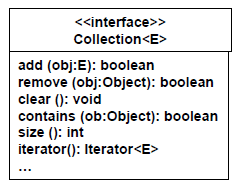

```java
public interface Collection<E> extends Iterable<E> 
```

- Iterable stellt iterator() zur Verfügung
- Wichtig für selbst definierte Container-Klassen!

```java
ArrayList<String> cs=new ArrayList<String>();
cs.add("Ilse");
cs.add("Koch");

//möglich für Collections und Array
for (String s:cs) System.out.println(s);

//möglich auch:
for (Iterator<String> it=cs.iterator();it.hasNext();){
   String str=it.next();
   System.out.println(str);
}

//bei ArrayList ausserdem:
for (int i=0;i<cs.size();i++) {
   String str=cs.get(i);
   System.out.println(str);
} 
```

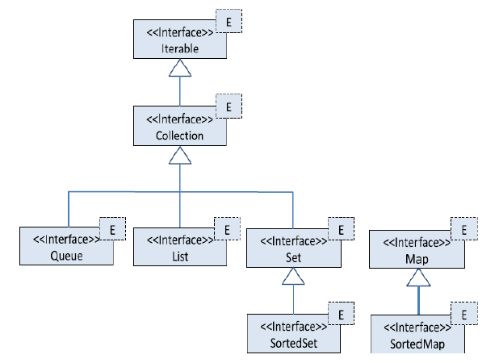

Quelle: Jörg Hettel, Manh Tien Tran, Nebenläufige Programmierung mit Java

```
Set (HashSet, CopyOnWriteArraySet, …)
Queue (ArrayBlockingQueue, PriorityQueue,…)
List (ArrayList, CopyOnWriteArrayList,…)
Map (HashTable, HashMap, ConcurrentHashMap…)
```

```java
//ArrayList - Beispiel
public enum Priorität {NORMAL, DRINGEND}
public class Akte {
   public String regisrierNummer;
   public Priorität priorität;
   public Akte(String regisrierNummer, Priorität priorität){ 	
      super();
      this.regisrierNummer = regisrierNummer;
      this.priorität = priorität;
   }
   @Override
   public String toString() {
      return "Akte ["+ regisrierNummer + " " + priorität + "]";
   }
}
```

```java
//ArrayList - Beispiel
import java.util.ArrayList;
public class Ordnen {
   public static void main(String[] args) {
      ArrayList<Akte> haufen=new ArrayList<Akte>();
      haufen.add(new Akte("A01",Priorität.NORMAL));
      haufen.add(new Akte("A02",Priorität.NORMAL));
      haufen.add(new Akte("A03",Priorität.DRINGEND));
      haufen.add(new Akte("A04",Priorität.DRINGEND));

      ArrayList<Akte> geordnet=new ArrayList<Akte>();
      int ind=0;
      for (Akte a:haufen)
         if (a.priorität==Priorität.DRINGEND){
            geordnet.add(ind, a); ind++;
        }
         else geordnet.add(a);

      for (Akte a:geordnet) System.out.println(a);
   }
}
//Ausgabe:
//Akte [A03 DRINGEND]
//Akte [A04 DRINGEND]
//Akte [A01 NORMAL]
//Akte [A02 NORMAL]
```

```java
//Hashtable - Beispiel
Hashtable<String,Double> spenden = new Hashtable<String,Double>();
spenden.put("Donald", 10.0);
spenden.put("Mickey", 100.00);

for (String key : spenden.keySet())
      System.out.println(key+": "+spenden.get(key));
 
if (spenden.get("Dagobert") == null){
       System.out.println("Dagobert hat nichts gespendet");
}
```

## Literatur

Christian Ullenboom: Java ist auch eine Insel http://openbook.rheinwerk-verlag.de/javainsel/

Goll, Joachim, Heinisch, Cornelia: Java als erste Programmiersprache


