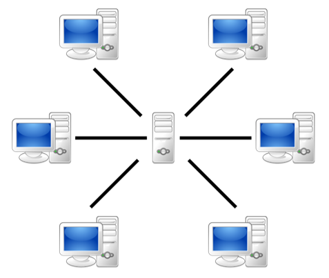
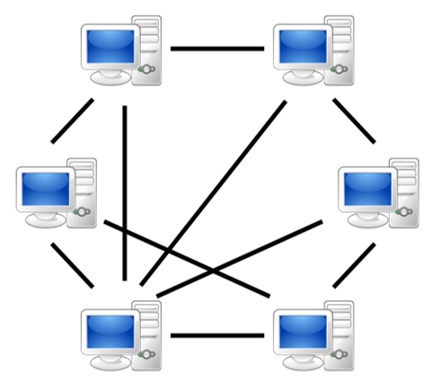
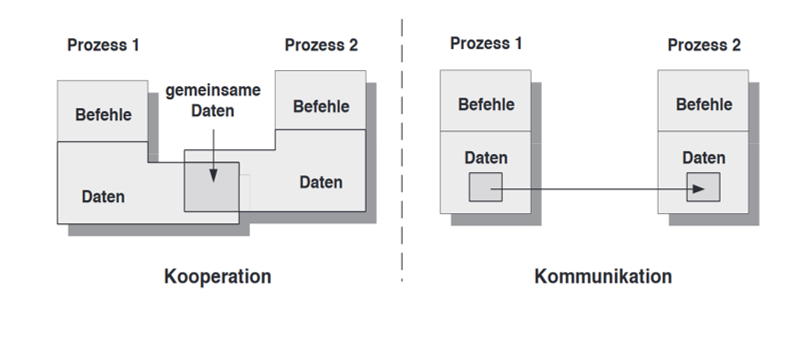
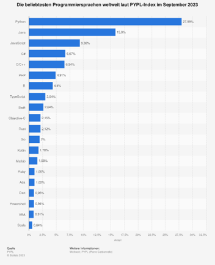
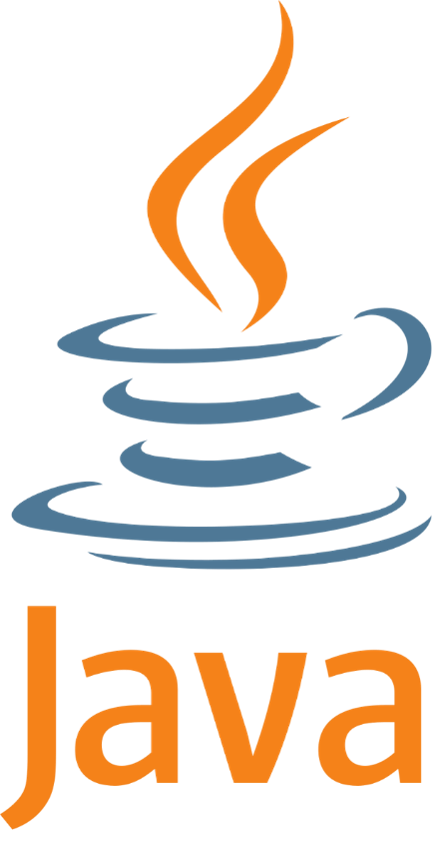
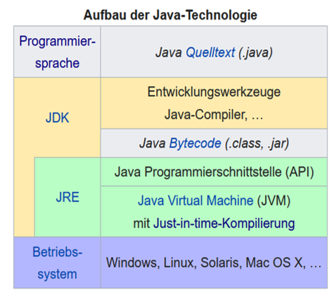
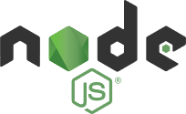

# Konzepte

## Definition
Verteilte Software = verteilte Anwendung

- eine komplexe Anwendung, die in einem verteilten System abläuft?
- durch die Programmierung der Anwendung wird das verteilte System erstellt?

Anfänge: 

1969 – Internetvorläufer ARPANET (Advanced Research Projects Agency) NET, Network Control Protocol (NCP) 

1970er – Client-Server-Architektur, Zeitkritische Systeme und verteilte Datenbanken

1983 – Entwicklung von Transmission Control Protocol/Internet Protocol (TCP/IP)

> "Ein verteiltes System ist eine Sammlung unabhängiger Computer, die den Benutzern als ein einziges zusammenhängendes System erscheint.“ 
> Andrew Tanenbaum

Kommt es auf die physische Verteilung drauf an? Aber was ist mit Cloud-Computing, Microservices und Container-Technologien?
 
> "A distributed system is one in which the failure of a computer you didn’t even know existed can render your own computer unusable."
> Andrew Tanenbaum

Moderneren Definitionen:
- eine Sammlung von Prozessen oder Diensten, die unabhängig voneinander ausgeführt werden und über Kommunikationsmechanismen koordiniert werden, unabhängig davon, ob sie auf einem oder mehreren Computern laufen. 
- Prozesse (Dienste) erbringen gemeinsam die Leistung zur Lösung einer Aufgabe
- Zum Austausch von Informationen müssen Prozesse über Netzwerke miteinander interagieren.

Beispiele?
Muss es immer eine verteilte Anwendung sein?

### Vorteile:
- effiziente Nutzung von Ressourcen
- betriebswirtschaftliche Gründe (Hochleistungsrechner vs. mehrere PCs)
- Zugriff auf entfernte Daten (Ressourcen) möglich
- robust durch redundante Datenkopien

### Nachteile:
erhöhte Komplexität in allen SWE-Phasen:
- Entwurf: Modell muss Kommunikationsmechanismen beachten
- Implementierung: durch Kommunikation zusätzliche Fehlerfälle 
- Test: entfernte Partner müssen simuliert werden
- Betrieb: Ausfälle einzelner Rechner können zu Gesamtausfällen führen
- Versionisierung und Konfiguration: muss konform gehen, um Austausch von Teilen zu ermöglichen

### Verteilung! Aber was wird verteilt?

- Daten
- Ausführung der Aufgaben

**Sichtweisen:**

- **physisch (systemorientiert)** – Verteilung der Software wird in der Verteilung auf Dienste, Module (Klassen etc., Pakete) abgebildet
- **logisch (problemorientiert)** - Verteilung auf Klassen (Objekte, Interfaces), Pakete

### Architektur (Struktur des Gesamtsystems)

> "Architektur ist eine strukturierende oder hierarchische Anordnung der Systemkomponenten sowie Beschreibung ihrer Beziehungen."
> Helmut Balzert

Wie wird verteilt?

- klassische Architekturen: Client-Server, Peer-to-Peer
- statisch festgelegte oder dynamische: in Rahmen einer konkreten Kommunikation Teilnehmer können unterschiedliche Rollen annehmen

## Architektur (Struktur des Gesamtsystems)

> "Architektur ist eine strukturierende oder hierarchische Anordnung der Systemkomponenten sowie Beschreibung ihrer Beziehungen." 
> Helmut Balzert

Verteilungarchitekturen:

- statisch festgelegte Architektur: Client-Server, Peer-to-Peer
- In Rahmen einer konkreten Kommunikation: Teilnehmer können unterschiedliche Rollen annehmen

### Client-Server

Quelle: Von User:Mauro Bieg, https://commons.wikimedia.org/w/index.php?curid=2551745

- Jeder Rechner im Kontext eines Dienstes ist entweder Client oder Server
- Client: nutzt Dienst
- Server: bietet Dienst an
- Basis für die Kommunikation: Protokoll
- Ein Server kann auf mehrere Rechner verteilt oder repliziert werden
- Ein Server kann andere Server beanspruchen

### Peer-to-Peer

Quellen: 
Von User:Mauro Bieg, https://commons.wikimedia.org/w/index.php?curid=2551745
Von User:Mauro Bieg, https://commons.wikimedia.org/w/index.php?curid=2551723

- Peer (engl. Gleichgestellter) nutzt oder bietet Dienste an im Kontext einer konkreten Kommunikation
- ohne zentrale Serverkomponente, aber meistens wird ein Rendezvous - Server benötigt
- skalierbar bezüglich der Größe
- hoch dynamisch

### Andere

- Multi-Tier-Architektur (n-Tier): erweitert das Client-Server-Modell um zusätzliche Schichten zwischen dem Client und dem Server, wie z.B. Präsentationsschicht (Frontend), Logikschicht (Middle Tier, in der die Geschäftslogik verarbeitet wird) bzw. Datenzugriffsschicht (Backend)
Beispiel: eine typische Webanwendung 

- Microservices-Architektur: teilt Anwendungen in kleinere, voneinander unabhängige Dienste auf, die miteinander über APIs interagieren.
Dienste haben eine spezifische Aufgabe und können unabhängig entwickelt, getestet und bereitgestellt werden, laufen oft in Containern oder virtuellen Maschinen und kommunizieren über ein Netzwerk.
Beispiele: Webanwendungen, mobile Anwendungen, Desktop-Anwendungen mit komplexer Geschäftslogik, Embedded Systems und IoT, Spiele

- Event-Driven Architektur: realisiert das Interagieren von Komponenten durch das Austauschen von Ereignissen. Dienste reagieren auf Ereignisse und führen daraufhin Aktionen aus.
Beispiele: IoT, medizinische Überwachung, Social Media, Finanz- und E-Commerce Plattformen

- Publish-Subscribe (Pub-Sub): Komponenten agieren entweder als Publisher (die Nachrichten senden) oder als Subscriber (die Nachrichten empfangen), das Interagieren läuft über einen Vermittler (Message Broker).

- Serverless Computing: sieht vor, dass der Entwickler den Code schreibt, ohne sich um die zugrundeliegende Infrastruktur kümmern zu müssen. Die Ausführung wird von einem Cloud-Anbieter übernommen, der die Skalierung, Wartung und Verteilung verwaltet.

- Grid Computing: nutzt eine Vielzahl von losegekoppelten Computern (meist über verschiedene Standorte verteilt), um große Mengen an Rechenleistung zu bündeln und komplexe (meistens spezielle) Aufgaben zu lösen.
Beispiel: wissenschaftliche Berechnungen wie SETI@home-Projekt (Suche nach außerirdischer Intelligenz zu Hause, 2004-2020)

## Interaktionsmuster

**Kooperation:** gemeinsamer Datenbereich 
        
**Kommunikation:** Austausch über Nachrichten

Quelle: Oliver Haase: Kommunikation in verteilten Anwendungen, Oldenburg

## Kommunikationsparadigmen

- Nachrichtenbasierte Kommunikation
     über Dienstprimitiven: send und receive,
     verbindungsorientiert, paketorientiert
     Sockets, Jakarta Messaging (Java Message Service)

- Fernaufruf
     Aufruf von Funktionen (Prozeduren) im anderen Adressraum (Remote Procedure Call - RPC)
    - Implementierungen:
        - Methodenfernaufruf (Remove Method Invocation - RMI)
        - CORBA (Common Object Request Broker Architecture)
        - Distributed Component Object Model (DCOM)

## Eigenschaften einer verteilten Anwendung

### Heterogenität

Anwendung ist eine Gesamtheit, die aus nicht gleichartigen Elementen besteht

- einheitliches Programmiermodell zur Entwicklung verteilter Software
	- Prozedurfernaufruf (remote procedure call, RPC )
    - Objektfernaufruf (remote method invocation, RMI)    
- grundlegende Bausteine einer Anwendung bilden Prozesse (Threads) und Nachrichtenaustausch
- hardwareunabhängiger übertragbarer Maschinencode inkl. Interpreter
	Zwischenkode und virtuelle Maschine

### Nebenläufigkeit
Die Fähigkeit einer Anwendung mehrere Aufgaben gleichzeitig ausführen zu können
	Nebenläufiger Server bedient mehrere Klienten gleichzeitig

> A developer stands before God and is granted three wishes.
> Developer: "I wish that all my distributed systems are always in sync!"
> God: "That's impossible. Pick another wish."
> Developer: "Okay, then I wish that my distributed systems never go down!"
> God: "Also impossible. Try again."
> Developer: "Fine, I wish that no one will ever complain about distributed systems again."
> God: "Now you're talking to the operations team!"

### Fähigkeit zur Fehlerbehandlung
Die Fähigkeit die Fehler zu erkennen und darauf  zu reagieren
Fehler können erkennbar (z.B. durch Prüfsummen) und nicht erkennbar sein (z.B. ein Server-Ausfall). Die Herausforderung ist, mit nicht erkennbaren Fehlern umzugehen.

- Fehler verbergen (maskieren): z.B. verlorene Nachrichten wiederholen, Dateien auf mehrere Datenträger sichern) oder abschwächen (z.B. fehlerhafte Nachrichten verwerfen). 
- Fehler tolerieren: einige Fehler können hingenommen werden und ggf. dem Anwender gemeldet werden

### Sicherheit
Informationen sicher über ein Netzwerk zu übertragen

- Vertraulichkeit: Informationen (Inhalte inkl. Absenderidentität) vor Unbefugten schützen (Verschlüsselung)
- Integrität: Schutz vor Veränderung oder Beschädigung der Informationen
- Verfügbarkeit: Vermeidung der Störungen während des Betriebs

### Verteilungstransparenz
Ziel jeder verteilten Anwendung
transparent heißt die Verteilung ist für Nutzer nicht sichtbar

Zugriffstransparenz (wie die Daten, in welchem Format gespeichert, sind)
Ortstransparenz (wo die Ressourcen sich befinden)
Migrationstransparenz (pre-Session Mobilität)
Relokationstransparenz (mid-Session Mobilität)
Persistenztransparenz (flüchtige oder persistente Speicherung)
Nebenläufigkeitstransparenz (mehrere Prozesse)
Replikationstransparenz (mehrere Kopien)
Fehlertransparenz (Verbergen von Ausfällen von Teilsystemen)

### Skalierbarkeit
skalierbar heißt kann wachsen ohne Veränderung der Eigenschaften 
Größe: 
      Möglichkeit des Hinzufügens von Komponenten

- geographische Verteilung:
System funktioniert unabhängig von der Entfernung

- administrative Verteilung:
System funktioniert über die Grenze der administrativen Domäne hinweg (verschiedene Sicherheitsrichtlinien)

## Anforderungen an Programmiersprache bzw. Technologie

- Netzfähigkeit: Netzwerk-Socket-Programmierung (TCP, UDP) bzw. Techniken auf höherer Abstraktionsebene (Remote Method Invocation (RMI), WebSockets…). Protokollunterstützung: für Protokolle wie HTTP, FTP, SMTP und WebSockets
- Nebenläufigkeit und Parallelität: 
    - Thread-Management: Threads oder andere Formen der Nebenläufigkeit wie Coroutines, Promises, async/await) bieten. 
    - Asynchrone Programmierung: die Fähigkeit blockierende Netzwerkaufrufe zu vermeiden
- Interoperabilität: Fähigkeit, Daten sicher und automatisch auszutauschen. D.h. die Sprachen sollen Mechanismen zur Kommunikation mit anderen Sprachen bieten. 
    - Serialisierung und Deserialisierung: eingebaute Unterstützung für Formate wie JSON, XML etc., um Daten zwischen verschiedenen Komponenten zu übertragen und zu interpretieren. 
- Plattformunabhängigkeit: Mechanismen, um Code plattformunabhängig auszuführen (z.B. durch Bytecode oder virtuelle Maschinen wie die JVM in Java).
- Sicherheit: Bibliotheken zur Verschlüsselung und Entschlüsselung von Daten (z.B. SSL/TLS) sowie zur Implementierung von Zugriffskontrolle bereitstellen.
    - Zugriffskontrolle: Mechanismen zur sicheren Authentifizierung (Überprüfung der Identität) und Autorisierung (Berechtigungen)
- Fehlertoleranz und Wiederherstellung: einschließlich die Fähigkeit, Netzwerkausfälle, Übertragungsfehler oder den Ausfall von Knoten zu erkennen und umzugehen.    
- Modularität: Fähigkeit große Anwendungen zu unterteilen und wiederverwendbare Komponenten zu entwickeln.
- Skalierbarkeit: Werkzeuge oder Frameworks, die die Skalierung von Anwendungen über mehrere Knoten hinweg ermöglichen, z.B. durch Unterstützung für Cloud-Computing-Plattformen oder Containerisierung (wie z.B. Docker).
- Umfangreiche Bibliotheken: eine Vielzahl von Bibliotheken oder Frameworks für häufige Aufgaben in verteilten Systemen (für Netzwerke, asynchrone Operationen, Protokollverarbeitung usw.) .

## Java – Programmiersprache und Technologie 

**Ranking-listen, z.B. PYPL (Popularity of Programming Language Index)**

- maßgeblich ist die Häufigkeit der Google Suchanfragen nach Tutorial
- weicht ab vom tatsächlichen Nutzen der Sprache

niederländische Software-Unternehmen TIOBE: berücksichtigt die Häufigkeit der Anfragen

Analyseanbieter SlashData: Umfragen von 30000+ developers and no-code creators aus 165+ Länder :
2022: JavaScript, Python, Java, C/C++, C#, PHP,…

Quelle: https://entwickler.de/programmierung/top-10-programmiersprachen-tiobe-pypl-devoloper-nation

1990 - erste Arbeiten bei Sun Microsystems (jetzt Oracle) unter Codenamen „Oak“ (Eiche) 
Zielstellung: eine Programmierplattform für Haushaltelektronik

1993 – Abänderung der Zielstellung: Entwicklung zur plattformunabhängigen OOP
Anwendungen, 
u.a. Internetgeeigneten Applikationen 

Mai 1995 – Veröffentlichung der Java-Technologie.
…
1.  März 2024 – Veröffentlichung von Java 22

### Java-Technologie 

Programmiersprache 
Java Development Kit (JDK) –Entwicklungswerkzeuge …
Java-Compiler javac, 
Java-Interpreter java, 
JRE
Dokumentation javadoc
Debugger jdb
Bibliotheken
Archivierungstools
…
Java-Laufzeitumgebung (JRE) – zum Ausführen vom Java-Bytecode 
JVM

Quelle: https://de.wikipedia.org/wiki/Java-Technologie

### Kotlin

OO, erbt wichtige Fähigkeiten von Java und verbessert sie durch moderne Sprachfeatures (Null-Sicherheit, Coroutinen für Nebenläufigkeit)
wird insbesondere zur Entwicklung von Android-Anwendungen verwendet.

1.  April 2012 - erster Milestone Release, erster eigenständig lauffähiger Compiler, erste Version der Kotlin-Standardbibliothek
2.  Juni 2012 – wurde Android Support eingeführt
2019 - Google hat Kotlin zur bevorzugten Programmiersprache für Android erklärt

### JavaScript

läuft in jedem modernen Browser, 
dynamisch typisiert, objektbasiert und funktional, 
verwendet ein eventbasiertes Modell,
bietet mit Node.js starke Unterstützung für Netzwerkanwendungen, indem es APIs für den Umgang mit HTTP, WebSockets und anderen Netzwerkprotokollen bereitstellt
wird häufig für serverseitige, verteilte Systeme verwendet.

18. September 1995 – Veröffentlichung als in Netscape Navigator eingebettete Sprache LiveScript
1996 – erste Version (1.0.0) für Netscape Navigator und Internet Explorer
Juni 2023 - aktuelle Version 
Mai 2009 – Veröffentlichung einer plattformübergreifenden Open-Source-JavaScript-Laufzeitumgebung Node.js

## Themen

- Kurz Java (OO-Konzepte, Exceptions, Ein- und Ausgabe)
- Nebenläufigkeit (Threads, Runnable, ThreadPools etc.)
- Kommunikation über Sockets (TCP, UDP, TLS)
- Android (Componenten, Hintergrundausführung)
- RMI (Remote Method Invocation)
- Jakarta Messaging (Java Message Service - JMS)
- Web-Anwendungen (HTML, Node.js, Servlet (Spring Tools), Sicherheit in Web-Anwendungen)

