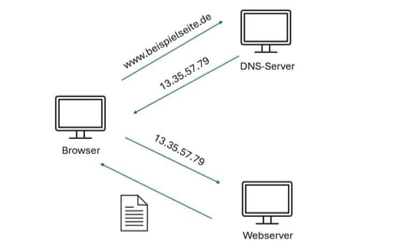

# Kommunikationsprotokolle
## Schichtenmodell

- Komplexen Kommunikationsvorgänge werden in einzelne Schritte aufgegliedert und in mehreren Schichten übereinandergestapelt. 
- Jede Schicht definiert bestimmte Aufgaben und Funktionen. Zur Lösung dieser Aufgaben existieren spezielle Verfahren und Protokolle. 
- Jede Schicht verfügt jeweils über Schnittstellen zur darüber oder darunter liegenden Schicht.
- Die darunter liegenden Schichten sind „Übersetzer“ für darüber liegenden.
- Übertragungsweg, Protokolle und Anwendung genormt und genau spezifiziert.
- Referenzmodelle: OSI (Open System Interconnection model) und TCP/IP-Referenzmodell (DoD - Department of Defense)
    - OSI- Referenzmodell: theoretisches Konzept, Schichten unterstreicht verschiedene Aspekte der Kommunikation
    - TCP/IP-Referenzmodell: eine praktische Implementierung
- Für das Internet und die Internetprotokollfamilie wird die Gliederung nach TCP/IP-Referenzmodell verwendet.

Die Teile einer verteilten Anwendung, ob sie auf verschiedenen Rechner oder in verschiedenen Prozessen laufen, müssen miteinander kommunizieren. Threads können gemeinsame Daten zum Interagieren benutzen. Anders ist es wenn die Teile einer Anwendung in verschiedenen Prozessen (auf verschiedenen Rechner) laufen.
In der Computer- und Netzwerktechnik werden die komplexen Kommunikationsvorgänge in einzelne Schritte aufgegliedert und in mehreren Schichten übereinandergestapelt. Jede Schicht definiert für die Kommunikation zwischen zwei Systemen bestimmte Aufgaben und Funktionen. Zur Lösung dieser Aufgaben existieren in jeder Schicht spezielle Verfahren und Protokolle. Die untergeordneten Schichten stellen dabei den übergeordneten eine bestimmte Dienstleistung zur Verfügung. Jede Schicht verfügt jeweils über Schnittstellen zur darüber- oder darunterliegenden Schicht.
Das Schichtenmodell wird häufig mit der Kommunikation zwei Personen, die zwei unterschiedliche Sprachen sprechen, verglichen. Beide Personen sind wegen der unterschiedlichen Sprache nicht in der Lage direkt miteinander zu kommunizieren und bedienen sich deshalb eines (in geschlossenen proprietären Systemen) oder zwei (in offenen Systemen) Übersetzers.
In offenen Systemen sind Übertragungsweg, Protokolle und Anwendung genormt und genau spezifiziert.
Bekannt sind zwei Schichtenmodelle. Das OSI-Schichtenmodell und das DoD-Schichtenmodell (auch TCP/IP-Referenzmodell genannt). Obwohl das Internet und damit alle Netzwerke auf dem DoD-Schichtenmodell basieren, wird vielfach auf das OSI-Schichtenmodell Bezug genommen. Das OSI-Schichtenmodell wurde später entwickelt, ist feiner gegliedert und flexibler. So lässt das OSI-Schichtenmodell die Zusammenfassung oder Entfernung einzelner Schichten zu.


Quelle: https://de.wikipedia.org/wiki/Internetprotokollfamilie#TCP/IP-Referenzmodell

## Schichten des TCP/IP Referenzmodells für Netzprotokolle

- Netzzugang (Link Layer)
Techniken (mechanische und elektrische Mittel) der Datenübertragung von Punkt zu Punkt
   - Physical Layer: Bitübertragungsschicht
   - Sicherungschicht (Data Link Layer): Aufteilen des Bitstroms in Blöcke (Frames), Hinzufügen von Prüfsummen etc. 

Die Netzzugangsschicht ist im Modell zwar spezifiziert, enthält aber keine Protokolle der TCP/IP-Familie. Sie ist vielmehr ein Platzhalter für verschiedene Techniken der von Punkt zu Punkt Datenübertragung und entspricht der Sicherungs- und Bitübertragungsschicht des OSI-Referenzmodells.

- Internet (Internet Layer)
Vermittlung von Datenpaketen über den gesamten Kommunikationsweg:
    - Routing (Wegsuche) zwischen den Netzknoten 
    - eindeutige Adressierung durch IP (Internet Protocol)

Die Internetschicht ist für die Vermittlung von Paketen und die Wegsuche zuständig. Die Aufgabe dieser Schicht ist es, zu einem empfangenen Paket das nächste Zwischenziel zu ermitteln und das Paket dorthin weiterzuleiten. Der Kern dieser Schicht ist das Internet Protocol (IP) mit dem eine eindeutige Adressierung ermöglicht wird. Die Internetschicht entspricht der Vermittlungsschicht des OSI-Referenzmodells.

- Transport (Transport Layer) 
Ende-zu-Ende-Kommunikation Adressierung wird durch „Kontaktpunkte“ (Portnummern) ergänzt
    - Transportprotokolle 
        - UDP (User Datagram Protocol)
        - TCP (Transmission Control Protocol)

Die Transportschicht ermöglicht eine Ende-zu-Ende-Kommunikation. Die IP-Adressierung wird durch „Kontaktpunkte“ (Portnummern) ergänzt. Das wichtigste Protokoll dieser Schicht ist das Transmission Control Protocol (TCP), das die sichere Verbindungen zwischen jeweils zwei Netzwerkteilnehmern ermöglicht. Es gehört aber auch das unzuverlässige User Datagram Protocol (UDP) in diese Schicht.

- Anwendung (Application Layer)
stellt alle Protokolle für die Anwendungen zur Verfügung, ist zuständig für Verbindung zu den unteren Schichten
    - Session  Layer: Protokolle zum organisierten und synchronisierten Datenaustausch wie RPC (Remote Procedure Call)
    - Presentation Layer: Umwandlung systemabhängiger Daten, Anpassung zw. Systemen, Datenkompression und Verschlüsselung

## Internet – Adressen 

Damit Nachrichten, Pakete bzw. generell Kommunikationsanfragen das richtige Adressat finden, wird jedem Verbindungspunkt (jedem Rechner in Internet) eine eindeutige und zwar eine weltweit eideutige IP-Adresse zugeordnet. Internet Protocol gibt es in den Versionen 4 und 6. 
Mit IPv4 ist die Adressierung von theoretisch vier Milliarden Rechner möglich. Da aber mit der Zeit das Internet immer größere Verbreitung erlangte, war zu befürchten, dass die Adressen nicht ausreichen werden. Im Dezember 1998 wurde IPv6 offiziell zum Nachfolger von IPv4 ernannt. Damit wurde die Vergrösserung des Adressraums auf 340 Sextllionen erreicht.

**IPv4:**

32 Bit, 4X8, (2 hoch 32 Adressen)

Dezimalnotation 
0..255,  d.d.d.d	139.20.17.101
 
| <244 	    | einzelne Rechner (Unicast) – Adressen-Klassen A, B und C |
| 224.. 239 | D-Klasse: Multicast-Adressen, Gruppen-Adressen von 224.0.0.0 bis 239.255.255.255 (jede mit FF00::/8 beginnende Adr.) |
| >239 	    | E-Klasse: reservierter Bereich |


 | |Klasse A | Klasse B | Klasse C |
 | :--------------- | --------- | --------- | -------- |
 | Adressbereich | 1.0.0.0 – 126.0.0.0 |  1.280.0.0 – 191.255.0.0 |  192.0.0.0 – 233.255.255.0 |
 | Verwendung | ISPs, sehr große Netzwerke (große Organisationen) | mittlere bis große Netzwerke (Universitäten, Unternehmen) | kleine Netzwerke (kleine Unternehmen) |
 
 
**IPv6:** (seit 1998)

128 Bit, 8X16, (2 hoch 128 Adressen)		
Hexadezimalnotation, (0..ffff)  
2001:0db8:0000:0000:0000:ff00:0042:8329

Während es im Netzwerkumfeld gemeinhin zum guten Ton gehört, sinnvolle Dual-Stack-Setups mit Unterstützung für IPv4 und IPv6 zu bauen, sehen viele Anbieter das Thema entspannt: Große Seiten wie GitHub unterstützen IPv6 bis heute nicht. Oft ist in diesem Kontext vom Henne-Ei-Problem die Rede, denn ISPs bieten IPv6 nicht an, weil seitens der Kundschaft vorgeblich die Nachfrage nicht ausreicht – schließlich seien viele Seiten im Netz per IPv6 nicht erreichbar. Vom erklärten Ziel, der absehbaren Knappheit von IPv4-Adressen durch die Vergrößerung des Adressraumes ein Ende zu setzen, ist IPv6 jedenfalls bis heute weit entfernt. Mit IPv4-Adressen hat sich längst ein reger Handel etabliert.

> Geoff Huston (Asia-Pacific Network Information Center), Okt. 2024:  das Ziel, IPv4 vollständig durch IPv6 zu ersetzen, sei in obsolet, CDNs (Content Delivery Network – Netzwerk verteilter Servern), wo primäre DNS-Adressen (nicht IPs) wichtig sind, liefern Webinhalte effizienter und schneller (Quelle: https://www.heise.de/news/APNIC-Chefwissenschaftler-IPv6-Einfuehrung-wohl-obsolet-9995140.html https://www.heise.de/meinung/Kommentar-zu-IPv6-Bremsern-Ist-das-noch-gutes-Internet-10014220.html )

Die IP-Adressen, speziell IPv6 stellen für Rechner kein Problem dar, für uns Menschen mit den Namen zu agieren ist dennnoch viel angenehmer als mit den Nummern. Es werden deswegen parallel zu den Adressen hierarchisch aufgebaute Namen geführt, z.B. www.informatik.tu-freiberg.de

+ Namen (z.B. www.informatik.tu-freiberg.de) werden in IP-Adresse vom Domain Name System (DNS) umgesetzt (wie Telefonauskunft)
+ DNS – ein hierarchisches verteiltes System, ermöglicht die Namensauflösung für das gesamte Internet



Quelle: https://www.seokratie.de/guide/dns/


## Kommunikationsformen

### Unicast
Übertragung von Nachrichten zwischen einem Sender 
und einem einzigen Empfänger - genau ein Ziel

**Spezielle Adressen:**
unspezifiziert 	  	0.0.0.0	 [::]
loopback (localhost)	127.0.0.1	 [::1]

### Multicast
eine Nachrichtenübertragung von einem Punkt zu einer Gruppe - mehrere Ziele


### Broadcast
eine spezielle Form der Mehrpunktverbindung (alle Teilnehmer eines lokalen Netzwerks)

+ eigenes lokales Netz: 255.255.255.255
+ 192.168.1.255 die Broadcast-Adresse des Subnetz 
+ 192.168.1.0/24 (alle IP-Adressen von 192.168.1.1 bis 192.168.1.254)
  


## Klasse  InetAddress 

- geeignet für beide IP-Adresstypen, 
- Spezielle Klassen: Inet4Address, Inet6Address

Anlegen des Objektes:

```java
static InetAddress getLocalHost() throws UnknownHostException
static InetAddress getByName(String host) throws UnknownHostException
static InetAddress getByAddress(byte[] addr) throws UnknownHostException

InetAddress ia1 = InetAddress.getByName("pc1.informatik.tu-freiberg.de");
InetAddress ia2 = InetAddress.getLocalHost();
```

Weitere Methoden:
```java
String getHostname()		//Rechnername
String getCanonicalHostName()	//qualifizierter Domainame
String getHostAddress()		//IP-Adresse
byte[] getAddress()		//IP-Adresse
```

Achtung: Die Adresse allein reicht nicht zur Identifizierung einer Internet-Ressource (einer Webseite, Webservice, Email-Empfänger, Datei, …)!
Eindeutige Identifikation benötigt mehr Informationen, z.B. Art der Ressource ….

## Uniform Resource Identifier (URI) / Uniform Resource Locator (URL) 

```
scheme ":" [ authority ] path [ "?" query ] [ "#" fragment ] 
```

- Schema oder Protokoll (Art der Ressource)	
	z.B. https, ftp, mailto, tel, …
- Anbieter oder Server (authority) inkl.  Host (Name, IPv4, IPv6), Portnummer (Integer-Wert) 
- Pfad		
- Abfrage – Query-String mit zusätzlichen Informationen (evtl.)
- Fragment (evtl.)

Beispiele:
```
https://beispiel.de:8042/pfad/nochpfad?abfrage=text#stelle
https://de.wikipedia.org/wiki/Uniform_Resource_Identifier  
tel:+49-111-111-111
mailto:anonymous@info.com
telnet://179.20.17.102
geo:50.91,13.34;u=400

```
- Bei URI geht es nur darum, die Resource zu identifizieren, nicht um den Zugriffsmechanismus!
- Uniform Resource Locator (URL) identifiziert und lokalisiert eine Ressource u.a. über die Zugriffsmethode (Protokoll), erste und häufigste Art von URI
- Uniform Resource Name URN (weltweit eindeutiger Name), z.B. urn:ISBN:3-8273-7019-1 

### Klasse URI

```java
//hat mehrere Konstruktoren
public URI(String scheme,		
           String userInfo,	
           String host,		
           int port,			
           String path,		
           String query,		
           String fragment) throws URISyntaxException
```

### Klasse URL 

```java
//bis Java 20: mehrere Konstruktoren
public URL(String url) throws MalformedURLException
public URL(String protocol,
           String host,
           String file) throws MalformedURLException
public URL(String protocol,
           String host,
           int port,
           String file) throws MalformedURLException

//ab Java 20: wird aus URI-Objekt konstruirt
public URL toURL()

```

### URL-Verbindung

URL beschreibt eine Ressource. Um darauf zuzugreifen wird Verbindung benötigt. 
Die URL-Verbindungen sind High-Level-Verbindungen, auf dieser Ebene muss man nicht um die Übertragungsprotokolle kümmern. Alle "höheren" Verbindungen bauen aber auf Sockets auf.


- zur Kommunikation mit der URL-Ressource
- ist eine High-Level-Verbindung z.B. über Übertragungsprotokolle wie http
- bauen auf Sockets auf 
- abstrakte Klasse(n): java.net.URLConnection (HttpURLConnection)


```java
URLConnection URL::openConnection() throws IOException

void connect() throws IOException

Map<String, List<String>> getHeaderFields()
Object getContent() throws IOException

InputStream getInputStream() throws IOException
OutputStream getOutputStream() throws IOException
```

**Zugriff auf URL-Resource**

- Objekt erzeugen: openConnection()
- Eigenschaften festlegen: setXXX(), z.B. setUseCaches
- ggf. wegen geänderter Eigenschaften Verbindung herstellen: connect()

```java
import java.io.*;
import java.net.*;

public class Show_URLText
{ 
  public static void main( String args[] ) 
  { URL url;
    URLConnection connection;
		try
        {   
          url = new URL("http://www..../datei.txt" );
          //url = new URI ("http://www..../datei.txt").toURL();
          connection = url.openConnection();
 		  connection.setUseCaches( false );
          connection.connect();
          InputStream is=connection.getInputStream();
     	  BufferedReader in = new BufferedReader ( new InputStreamReader(is));
		  while( (s = in.readLine() )!= null ) System.out.println(s);
      }
      catch (MalformedURLException e)
      { System.out.println("Url fehlerhaft");
      } 
      catch (IOException e) 
      { System.out.println("Ein/Ausgabefehler");
      } 
    }
  }
```

## Kommunikation über Sockets

### Socket

- alle höhere Verbindungen (HTTP, FTP, SMTP) basieren auf Sockets
- Socket ist ein Verbindungspunkt im Netz
- Socket bildet eine Schnittstelle zwischen Transport- und Anwendungsschicht, kapseln die Details der Transportschicht (UDP: verbindungslos, TCP: verbindungsorientiert)
- bekommt eine IP-Adresse und Port-Nummer
- jeder Kommunikationsbeteiligte (Client und Server) implementiert einen Socket


Socket-Konzept wurde in 80er Jahre an der Berkley-Universität für UNIX entwickelt und hat der Ausbreitung von Internet verholfen.

**Port-Nummer**

System-Ports: 0 bis 1023 („well known“)

 - sind für Netzwerkdienste vorgesehen


Registrierte Ports: 1.024 bis 49.151 

- in der Regel von Softwareunternehmen registriert,           
- IANA (Internet Assigned Numbers Authority)
  
Dynamische Ports oder private Ports: 49.152 bis 65.536

-  für die dynamische Zuordnung an Clientprogramme
  

443 – HTTPS, 80 – HTTP, 21 – FTP, 25 – SMTP

Liste der IANA-Zuordnungen: 
https://www.iana.org/assignments/service-names-port-numbers/service-names-port-numbers.txt


### Verbindungslose Kommunikation – UDP (User Datagram Protocol)

- nur Operationen zum Senden und Empfangen
- Schnell aber unzuverlässig
- Empfänger muss empfangsbereit sein 
- Sender kennt Empfänger (IP-Adresse und Port)
- Empfänger erfährt die Absenderadresse mit dem Empfang der Nachricht (Pakets)
	


**Datenpaket**
	- Daten
	- IP-Adresse des Ziels
	- Portnummer
	- Absenderadresse
  - Gesamtlänge und Check-Summe (nur Kontrolle)
  
Klasse  **DatagramPacket**

```java
DatagramPacket(byte[] buf, int offset, int length, InetAddress address, int port)
DatagramPacket(byte[] buf, int length)
//aber auch set-Methoden
```

Klassen  **DatagramSocket** und **MulticastSocket**


```java
DatagramSocket() throws SocketException	   //any port und local host
DatagramSocket(int port, InetAddress laddr)	 throws SocketException  //spec. local host              			
MulticastSocket(int port) throws IOException
```

### Senden
- void send(DatagramPacket packet) throws IOException
- zuvor das Packet vorbereiten mit Informationen über Empfänger

```java
InetAddress ia;
ia = InetAddress.getByName("sende.wohin.?? " );
int port = 4711;
String s = "Die Botschaft";
byte[] data = s.getBytes();
packet = new DatagramPacket( data, data.length, ia, port );
DatagramSocket socket = new DatagramSocket();
socket.send( packet ); 
```

### Empfangen
- void receive(DatagramPacket packet) throws IOException
- zuvor Paket vorbereiten mit Datenpuffer
- nur Pakete mit bekannter Portnummer werden empfangen

```java
byte[] data = new byte[ 1024 ]; 
DatagramPacket packet = new DatagramPacket( data, data.length );
DatagramSocket socket = new DatagramSocket( 4711 );
socket.receive( packet ); 
```

### Beispiel
```java
/* sende ein UDP - Paket */
import java.io.*;
import java.net.*;

public class UDPSend 
{ 
  public static void main( String args[] ) 
  { 
	  InetAddress iaddr;                           
    int port = 12345;
	  String meldung="Die Meldung";
    try 
    { DatagramSocket d_socket = new DatagramSocket();
      iaddr = InetAddress.getByName("server.informatik.tu-freiberg.de");
      byte[] data = meldung.getBytes();
      DatagramPacket packet;  
      packet = new DatagramPacket(data, data.length, iaddr, port);
      d_socket.send(packet);     
      d_socket.close();
    }
    catch (SocketException e)     {System.out.println(e);}
    catch (UnknownHostException e){System.out.println(e);}
    catch (IOException e)         {System.out.println(e);}
  }
}
```

```java
/* empfange 3 UDP Pakete */
import java.io.*;
import java.net.*;

public class UDPReceive
{ public static void main( String args[] ) 
  {
	 int port = 12345;        
    byte[] buffer = new byte[1024];                
    DatagramPacket packet;
    DatagramSocket d_socket;
    packet = new DatagramPacket(buffer, buffer.length);
    try
    { d_socket = new DatagramSocket(port); 
      for (int i = 0; i < 3; i++)
      { d_socket.receive(packet);
        String s = new String( buffer, 0, packet.getLength() );
        System.out.println( "UDPReceive: from "      
           + packet.getAddress().getHostName() 
           + ":" + packet.getLength() + ":" + packet.getPort() + ":" + s );
        packet.setLength(buffer.length);
      }
      d_socket.close();
    }
    catch (SocketException e) {System.out.println(e);}
    catch (IOException e)     {System.out.println(e);}
  }
}
```

### Broadcast

- Broadcast-Funktionalität aktivieren mit setBroadcast(true)
- Senden an eigenes lokales Netz (255.255.255.255) oder die Broadcast-Adresse des Subnetzes 
- weiter wie gehabt


### Multicast (mehrere Empfänger):
 
- Senden per UDP an Klasse D Adressen (224.0.0.0-239.255.255.255)
- Empfangen an Multicast-Adresse/Portnummer mit dem Multicast-Socket `MulticastSocket(int port)`
 
- Beitreten einer Empfängergruppe
  
```java
NetworkInterface netIf = NetworkInterface.getByName("Ie0");
// identif. lokale Schnittstelle, an der eine Multicast-Gruppe angeschlossen ist
void joinGroup(SocketAddress group, NetworkInterface netIf) throw IOException
```

- Empfangen mit receive

- Verlassen der Empfängergruppe `void leaveGroup(SocketAddress group, NetworkInterface netIf) throw IOException`

### Beispiele

```java
/* empfange 3 UDP Pakete als Multi-Cast*/
import java.io.*;
import java.net.*;
public class UDPMultiCast{ 
  public static void main( String args[] )  {
     int port = 55555; 
     byte[] buffer = new byte[1024]; 
     DatagramPacket packet = new DatagramPacket(buffer, buffer.length);
     MulticastSocket mc_socket; 
     InetAddress adr;
     InetSocketAddress group;
     try
     { adr = InetAddress.getByName("239.255.255.255");
       group = new InetSocketAddress(adr, port);
       NetworkInterface netIf = NetworkInterface.getByName("Ie0");
       mc_socket = new MulticastSocket(port);
       mc_socket.joinGroup(group,netIf);
       for (int i = 0; i < 3; i++)
       { mc_socket.receive(packet);
         String s = new String( buffer, 0, packet.getLength() );
         System.out.println("MultiCastReceive: from " 
                            + packet.getAddress().getHostName() 
                            + ":" + packet.getLength() + ":" + packet.getPort() + ":" + s );
         packet.setLength(buffer.length);
       }
       mc_socket.leaveGroup(group, netIf);
       mc_socket.close();
     }
     catch ( IOException e) {System.out.println(e);}
  }
}

```

```java
import java.net.DatagramSocket;
import java.net.DatagramPacket;
import java.net.InetAddress;

public class UdpBroadcastBeispiel {
    public static void main(String[] args) {
        try {
            DatagramSocket socket = new DatagramSocket();
            socket.setBroadcast(true); // Aktivieren der Broadcast-Option

            String message = "Broadcast Nachricht";
            byte[] buffer = message.getBytes();

            // Broadcast-Adresse (z.B. 255.255.255.255 
            // oder die spezifische Subnetz-Broadcast-Adresse)
            InetAddress broadcastAddr = InetAddress.getByName("255.255.255.255");

            DatagramPacket packet = new DatagramPacket(buffer, buffer.length, broadcastAddr, 55555);
            socket.send(packet);
            
            socket.close();
        } catch (Exception e) {
            e.printStackTrace();
        }
    }
}
```

## Verbindungsorientierte Kommunikation – TCP (Transmission Control Protocol)

**Verbindungsaufbau und Datenübertragung:**

1. Verbindungsaufbau (unterschiedlich für Client und Server): 
   - Client initiiert die Verbindung zum laufenden Server. 
   - Server wartet an einem speziellen Socket (Server-Socket), stellt einen weiteren Socket zum Kommunizieren zur Verfügung. - -
   - Server-Socket kann für weitere Verbindungsannahmen benutzt werden.
2. Datenübertragung über Input- und Output-Streams
3. Verbindungabbau, erst Client, dann Server

TCP Socket – Kommunikationsendpunkt mit zwei Datenströmen


Klassen **Socket** und **ServerSocket**


```java
Socket(InetAddress endpoint, int port) throws IOException
void bind(SocketAddress bindpoint) throws IOException
//ordnet dem Socket eine lokale Adresse zu
void connect(SocketAddress endpoint) throws IOException
//stellt eine Verbindung zu einer entfernten (Server)-Adresse her

InputStream getInputStream() throws IOException
OutputStream getOutputStream() throws IOException

ServerSocket(int port) throws IOException
Socket accept() throws IOException
```

### Beispiel

**Client:**
1. Zieladresse (Objekt) erstellen
2. Socket anlegen (mit Zieladresse und Zielport)
3. Datenströme vom Socket abfragen
4. Kommunizieren über Datenströme mit Hilfe von read() und write() 
5. Datenströme und Socket mit close() schließen

```java
/* sende Nachricht über Socket zum TCP-Server und empfange von dort Antwort */
import java.io.*;
import java.net.*;

public class TCPClient
{ 
  public static void main(String[] args)
  {
    String anfrage= " Anfrage ";
    InetAddress host=InetAddress.getByName(" … ");
	  int port=11111;
    try
    { 
      Socket socket = new Socket(host, port);
      OutputStream zum_server = socket.getOutputStream();
      zum_server.write(anfrage.getBytes() );
      BufferedReader vom_server 
            = new BufferedReader(new InputStreamReader(socket.getInputStream())); 
      String antwort = from_server.readLine();
      System.out.println("Der Server meldet: " + antwort);
      zum_server.close();
      vom_server.close();
      socket.close();
    }
    catch (IOException e)
    		{ System.out.println("Kommunikationsfehler " + e.getMessage());  }
    }
}
```

**Server:**
1. ServerSocket anlegen
2. ServerSocket wartet auf Anfragen 
3. akzeptiert die Anfrage und stellt ein Socket zur Verfügung, ServerSocket kann weitere Anfragen bedienen
4. Datenströme vom (Kommunikations-)Socket abfragen und Kommunizieren mit Hilfe von read() und write() 
5. Datenströme und Sockets (inkl. ServerSocket) mit close() schließen

Server braucht Klassen ServerSocket und Socket, Client nur Socket

```java
/* empfange Nachricht über Socket vom TCP-Client und sende dorthin Antwort */
import java.io.*; 
import java.net.*;

public class TCPServer { 
  public static void main(String[] args) { 
    byte b[] = new byte[64]; 
    String antwort = "Das ist die Antwort vom Server";
	  int port=11111;
    try { 
      ServerSocket s_socket = new ServerSocket (port);
      Socket socket = s_socket.accept();
      System.out.println("verbunden mit: " + socket.getInetAddress().getHostName()
         + " Port: " + socket.getPort() + " local Port: " + socket.getLocalPort() );
      
		  BufferedInputStream vom_client = new BufferedInputStream(socket.getInputStream());
      while (vom_client.available() == 0) ;
      vom_client.read(b);
      System.out.println("Message form client: " + new String(b));

      OutputStream zum_client = s_client.getOutputStream();           
      zum_client.write(antwort.getBytes());

      vom_client.close();
      zum_client.close();
      socket.close();
      s_socket.close(); 
    }
    catch (IOException e) { System.out.println("Fehler bei Kommunikation: " + e); }
  }
}
```

**Nachteil der Single-Thread-Anwendung:**
es kann die Anfrage nur eines Clients bearbeitet werden, andere Anfragen müssen warten

**Lösung:** 
Kommunikationssocket an ein Thread oder ExecutorService weiter reichen

```java
/* empfange 3 Nachrichten über Socket vom TCP-Clients und sende jeweils eine Antwort */
/* die Verarbeitung der Nachrichten erfolgt nebenläufig */

import java.io.*;
import java.net.*;

public class TCPMultiServer{
    public static void main(String[] args){
        int port=…;
        try{   
            ServerSocket s_socket = new ServerSocket (port);
            
            for(int anz = 0; anz < 3; anz++){
                Socket socket = s_socket.accept();
                new ServerThread(socket, anz).start();
            }
            s_socket.close(); 
        }
        catch (IOException e) { 
            System.out.println("Fehler bei Kommunikation: " + e); 
        }
    }
}
```

```java
class ServerThread extends Thread{   
    Socket socket;
    public ServerThread( Socket socket, int nummer) {
        this.socket = socket;
        System.out.println("ServerThread " + nummer + " verbunden mit: " 
           + socket.getInetAddress().getHostName() + " Port: " + socket.getPort() );
    }
    public void run() {
        int size;
        byte b[] = new byte[64]; 
        String antwort = "Serverantwort: *";
        try {
            BufferedInputStream vom_client = new BufferedInputStream(socket.getInputStream());
            while ((size = vom_client.available()) == 0) ;
            vom_client.read(b);
            System.out.println("Message form client: " + new String(b));
					  OutputStream zum_client = socket.getOutputStream();
            if (size <= b.length)
                for(int i = 0; i < size; i++)
                   { sleep(300); antwort += ((char)b[i] + "*"); }
            zum_client.write(antwort.getBytes());
					  vom_client.close();
            zum_client.close();
            socket.close();
        }
        catch (Exception e) { e.printStackTrace(); }
    }
}
```

### Beispiel:

```java
public class Server {
  public static void main(String[] args) {
    ServerSocket servers;
    try {
      servers = new ServerSocket(5556);
      while (true){
        Socket socket=servers.accept();
        ServerThread st=new ServerThread(socket);
        st.start();
      }
    } catch (IOException e) { e.printStackTrace(); }
  }
}
```

```java
public class ServerThread extends Thread {
Socket socket;

public ServerThread(Socket socket) { 
  this.socket=socket;
}
public void run() {
  try {
    Scanner sca = new Scanner(socket.getInputStream());
    String s = sca.nextLine();
    System.out.println(s);
        
    PrintWriter pw = new PrintWriter(socket.getOutputStream(),true); //autoflush
    pw.println("Thank you for your message! I will get back to you later.");
    sca.close();
    pw.close();
    socket.close();
    }
    catch (IOException e) {e.printStackTrace();}
  }
}
```

Text zu übertragen – das geht, was geht noch?

### Versenden eines Objektes

- Serialisierung/Deserialisierung - persistent sichern und wiederherstellen. Übertragung übers Netz verwendet das gleiche Mechanismus 
- Java Object Serialization (JOS): Sichern der Objektstruktur im binären Format 
- rekursiver Ablauf unter Berücksichtigung doppelter Zugriffe und zyklischer Abhängigkeiten
- Voraussetzung: Implementierung von Interface Serializable (java.io.Seralizable)


- viele vordefinierte Klassen sind serialisierbar
- nicht serialisierbar:
    - z.B. Thread, Socket und viele Klassen des lang.io-Pakets
    - transient gekennzeichnete Variable
    - Klassenvariablen (static)

Versenden eines Objektes ist im Gesamtkonzept der Serialisierung zu sehen. 
Unter Serialisierung/Deserialisierung versteht man generell persistentes Sichern und Wiederherstellen eines Objektes. Hier geht es um die Standardserialisierung (keine XML-Serialisierung z.B.), d. h. die Objektstruktur wird im binären Format gesichert - das Verfahren wird Java Object Serialization (JOS) genannt. Beim Übertragen über das Netzwerk wird das selbe Mechanismus angewendet.
Zusammen mit Objekten werden auch Unterobjekte gesichert (bzw. übertragen). Beim Speichern wird der Objektbaum resursiv durchlaufen. Dabei werden doppelte Zugriff auf ein Objekt und zyklische Abhängigkeiten erkannt und berücksichtigt.
Die Voraussetzung für die Serialisierung ist die Implementierung in den jeweiligen Klassen des Interface Serializable. Bei vorhandenen vordefinierten Klassen ist das sowieso der Fall, mit Ausnahme von Thread, Socket und vielen Klassen des lang.io-Pakets, den bewusst ausgesparten mit dem Schlüsselwort transient gekennzeichnete Variable (z.B. Passwort) und Klassenvariablen (static) wegen Konflikte.

Bei den eigen definierten Klassen muss zu Serializieren das Interface Serializable implementiert werden. Serializable ist ein marker interface, d.h. es enthält keine Methoden, die zu implementieren wären, markiert nur die Klassen, die serialisiert werden dürfen.

- Interface: ```Serializable``` (marker interface)
- Klassen:
```ObjectOutputStream, ObjectInputStream```
- Serialisierung:
```writeObject(daten)```
falls Objekt nicht serialisierbar: java.io.NotSerializableException
- Deserialisierung:
```readObject()``` liefert Object
falls Klasse nicht verfügbar: java.lang.ClassNotFoundException


**Voraussetzungen:**

- gleiche Klassen müssen vorhanden sein, SerialisierungsID müssen übereinstimmen
- VM muss sie gleich interpretieren können
- beim Lesen Typumwandlung notwendig


```java
import java.io.Serializable;
import java.util.ArrayList;

public class Daten implements Serializable  {

	private static final long serialVersionUID = 1L;
	private ArrayList<String> inhalt;

	public Daten() {
		super();
		inhalt= new ArrayList<String>();
	}

	public ArrayList<String> getInhalt() {
		return inhalt;
	}
}
```

```java
import java.io.IOException;
import java.io.NotSerializableException;
import java.io.ObjectInputStream;
import java.io.ObjectOutputStream;
import java.net.Socket;

public class ClientDaten {
public static void main(String[] args) {   
   try {
      Daten daten=new Daten();
      vorbereite(daten);
      Socket socket = new Socket("localhost", 4445);
      ObjectOutputStream oos = new ObjectOutputStream(socket.getOutputStream());
      oos.writeObject(daten);
      ObjectInputStream ois = new ObjectInputStream(socket.getInputStream());
      Daten zurueck=(Daten)ois.readObject();
      for (int i=0;i<zurueck.getInhalt().size();i++) 
          System.out.println(zurueck.getInhalt().get(i));
      ois.close();
      oos.close();
      socket.close();
      } 
      catch (NotSerializableException e1) { e1.printStackTrace();
      } 
      catch (ClassNotFoundException e2) { e2.printStackTrace();
      } 
      catch (IOException e) { e.printStackTrace();
   }
}
public static void vorbereite(Daten daten){ /*…*/ }
}

```

```java
import java.net.ServerSocket;
import java.net.Socket;

public class ServerDaten {
  public static void main(String[] args) {
    try {
      ServerSocket server = new ServerSocket(4445);
      while(true) {
        Socket socket = server.accept();
        new ServerThread(socket).start(); 	   
      }
    } 
    catch (Exception e) {
	    e.printStackTrace();
    }
  }
}
```

```java
import java.io.ObjectInputStream;
import java.io.ObjectOutputStream;
import java.net.Socket;

public class ServerThread extends Thread {
  private Socket socket;
    
  public ServerThread(Socket socket) {
    super();
    this.socket = socket;
  }
  @Override
  public void run() {
    ObjectInputStream ois;
    try {
      ois = new ObjectInputStream(socket.getInputStream()); 	
      Daten daten = (Daten) ois.readObject();
      veraendere(daten);
      ObjectOutputStream oos = new ObjectOutputStream(socket.getOutputStream());
                oos.writeObject(daten);
      ois.close();
      oos.close();
      socket.close();
      } 
      catch (Exception e) {e.printStackTrace();}
  }
  public void veraendere(Daten daten){ /*…*/ }
}
```

### Verbindungsdaten  

- keine Methoden zum Verbindungsaufbau, nur Verbindungsdaten
- Klasse **InetSocketAddress**
- eine Kombination aus InetAddress und einer Portnummer
- repräsentiert eine Endpunktadresse
- mit getAddress() erhält man InetAddress-Instanz
- verfügt über weitere Methoden: getHostName(), getPort() etc


```java
InetSocketAddress(InetAddress addr, int port)
InetSocketAddress(int port)
InetSocketAddress(String hostname, int port)
```

enthält keine Methoden zum Verbindungsaufbau, nur Verbindungsdaten, aber wozu? 

- Objekte vom Typ InetSocketAddress sind serialisierbar, Socket nicht
- über SocketAddress-Objekte kann z.B. ein Timeout gesetzt werden
- kann als Parameter verwendet werden

```java
InetAddress address = InetAddress.getByName("139.20.17.101");
int port = 12345;
InetSocketAddress socketAddress = new InetSocketAddress(address, port);

InetAddress inetAddress = socketAddress.getAddress();

SocketAddress addr = new InetSocketAddress( host, port );
Socket socket = new Socket();
socket.connect( addr, 100 ); //timeout in 100 ms
```


### TCP vs UDP

> Was ist das Beste an TCP-Witzen? 
> Ich kann sie so lange erzählen, bis man sie versteht 


**TCP:** Pakete werden nacheinander zugestellt, vollständig, in der richtigen Reihenfolge und nicht doppelt

**UDP:** Pakete werden zugestellt ohne Garantie, dass alle Pakete ankommen, in der richtigen Reihenfolge, jedes einmal. Ggf. Korrektur –, Sicherungsmaßnahmen notwendig 


## Synchronisation

TCP:  verwendet Sequenznummern

Sequenznummern: triviale Form einer logischen Uhr

**Funktionsschema:**

- Jedem Paket wird eine Sequenznummer zugeordnet und die nächste Sequenznummer mit abgeschickt
- Empfänger kennt aus der Sequenznummer des vorangegangenes Pakets, welche Nachricht dran ist 
- Wird die Nachricht mit der niedrigeren Nummer empfangen, so wird sie verworfen
- Die Nachricht mit der höheren Nummer wird empfangen und in den Zwischenspeicher abgelegt
- Wenn die Nachricht mit der richtigen Nummer angekommen ist, wird Zwischenspeicher abgearbeitet
- Kommt die Nachricht nicht, wird sie nach einer gewissen Zeit von Sender abgefordert
- Nach einer gewissen Anzahl erfolgslosen Rückfragen bricht die Kommunikation mit einer Fehlermeldung ab

Konzepte, die verwendet werden, um Ereignisse oder Aktionen in verteilten Systemen zu organisieren und zu synchronisieren:

**Echtzeituhr:**

- misst physikalische Zeit 
- Synchronisation erfolgt, z.B. mittels Abfrage von Zeitservern und Umrechnungen der Verzögerung durch Übertragungszeit (verschiedene Algorithmen, Standard: Network Time Protokoll)

**Logische Uhr:**

- misst nicht die physikalische Zeit, gib den  Ereignissen einen eindeutigen (logischen) Zeitstempel
- erzeugt streng monoton steigende Werte, um den Ereignissen eine Kasualordnung zuzuweisen


Verfahren zum Zuweisen von eindeutigen Zeitstempeln an Nachrichten:

**Lamport-Uhr:**
- Jeder Prozess hat einen Zähler (die Uhr)
- Der aktuelle Stand des Zählers wird an jede Nachricht als Zeitstempel angehängt
- Zähler wird bei jedem Ereignis (Senden und Empfangen) erhöht: wenn eine Nachricht empfangen wird, deren Zeitstempel größer oder gleich dem aktuellen Stand der eigenen Uhr ist, wird der Wert der Uhr um eins erhöht. 
- Nachteil: unbekannt, welche Ereignisse kausal unabhängig (nebenläufig) sind

**Vektoruhr:**
- Berücksichtigt Nebenläufigkeit
- die Uhr jedes Prozesses besteht aus einem Vektor (Array), nicht nur einem Zähler
- Jeder Prozess merkt sich den Zählerstand aller anderen Prozesse
- Der aktuelle Stand der Uhr wird jeder gesendeten Nachricht angehängt 
- Bei jedem Ereignis wird immer nur der eigene Zähler erhöht
- Wird eine Nachricht empfangen, werden aus dem aktuellen und dem empfangenen Vektor elementweise Maxima gebildet

## Transport Layer Security – TLS 


Quelle: https://de.wikipedia.org/wiki/Transport_Layer_Security

- Protokoll zur sicheren Datenübertragung über Computernetzwerke, insbesondere im Internet
- Aufgabe: die Echtheit des kontaktierten Servers durch ein Zertifikat zu garantieren und die Verbindung zwischen Client und Server zu verschlüsseln.

**Bestandteile:** 

TLS Handshake - findet Schlüsselaustausch und eine Authentifizierung statt 

TLS Record - verwendet den im Handshake ausgehandelten symmetrischen Schlüssel für eine sichere Datenübertragung – die Daten werden verschlüsselt und mit einem MAC (Message Authentication Code) gegen Veränderungen geschützt übertragen. 

**Anwendung:**

- theoretisch auf alle denkbare Anwendungsprotokolle: HTTP (-Secure), SMTPS, POPS,  IMAPS, …

### TLS-Funktionsweise

Der Client baut eine Verbindung zum Server auf. 

Der Server schickt als Antwort seinen öffentlichen Schlüssel (public Key) und ein SSL/TLS Zertifikat zur Authentifizierung. Beim ersten „Kontakt“ nutzt TLS die asymmetrische Verschlüsselung. 

Der Client überprüft die Vertrauenswürdigkeit des Zertifikats und ob der Servername mit dem Zertifikat übereinstimmt. Optional kann sich der Client mit einem eigenen Zertifikat auch gegenüber dem Server authentifizieren. 

Der Client schickt dem Server einen symmetrischen privaten Schlüssel (eine mit dem öffentlichen Schlüssel des Servers verschlüsselte geheime Zufallszahl), oder beide berechnen den (kombinierten) Schlüssel mit dem Diffie–Hellman-(Merkle) -Schlüsselaustausch (DHM-Protokoll zur Schlüsselvereinbarung).

Dieser Schlüssel wird benutzt, um alle Nachrichten zu verschlüsseln und durch einen Message Authentication Code abzusichern.

### Moderne kryptographische Verfahren:

**Symmetrische Verschlüsselung:**

- ein Schlüssel für Verschlüsselung und Entschlüsselung von Daten ("geheimer Schlüssel" )
- schnell und effizient, eignet sich gut für die Verschlüsselung großer Datenmengen
- Herausforderung: der geheime Schlüssel sicher zwischen den Kommunikationspartnern auszutauschen

**Asymmetrische (öffentliche) Verschlüsselung:**

- zwei Schlüssel (öffentlicher und privater Schlüssel): der öffentliche Schlüssel zum Verschlüsseln oder zum überprüfen von Signaturen, der private Schlüssel zum Entschlüsseln/Signieren von Daten. Der private Schlüssel kann nicht mit realistischem Aufwand aus dem öffentlichen Schlüssel berechnet werden. 
- ist in der Regel langsamer und rechenintensiver als symmetrische Verschlüsselung
- wird daher oft für den sicheren Austausch von Schlüsseln und die digitale Signierung verwendet, während die eigentliche Datenverschlüsselung mit einem symmetrischen Schlüssel erfolgt


### Ein SSL/TLS-Zertifikat 

ist eine Datei, die von einer vertrauenswürdigen Zertifizierungsstelle (Certificate Authority, CA) ausgestellt wird. 

- enthält Informationen zur Identität des Servers bzw. der Website (Inhaber, Domane, …) , ein Ablaufdatum etc.
- Die Zertifikate werden bei Zertifizierungsstellen (ein Unternehmen, eine Non-Profit-Organisation oder eine Behörde ) beantragt. Weltweit gibt es weit über 700 Zertifizierungsstellen. 
- Die Zertifizierungsdienstanbieter unterliegen der Aufsicht der Bundesnetzagentur.
- Hosting-Anbieter für Websites oder Cloud-Plattform-Betreiber bieten ggf. integrierte Funktionen zur Beschaffung und Verwaltung von SSL/TLS-Zertifikaten. 
- Zertifizierungsstellen überprüfen und bestätigen die Identität des Antragstellers. 
- Zertifikat wird von der Zertifizierungsstelle digital signiert, um seine Echtheit zu gewährleisten. 
- Es gibt insgesamt drei Zertifikatstypen (Domain-Validated-Zertifikat – DV, Organisation-Validation-Zertifikat – OV, Extended-Validation-Zertifikat – EV), die sich durch einen unterschiedlichen Prüfaufwand bei der Zertifizierung unterscheiden und so eine entsprechend unterschiedliche Echtheitsstufe garantieren (https://www.elektronik-kompendium.de)
- TLS verwendet Zertifikate, die nach X.509-Internet-Standard formatiert sind, d.h. enthalten die Informationen zur Identität und den öffentlichen Schlüssel.

**Vertrauenswürdige Zertifikate**

Die Webbrowser und Betriebssysteme verfügen über eine vordefinierte Liste von vertrauenswürdigen Zertifizierungsstellen. 
Nur Verbindungen zu den Servern mit diesen SSL/TLS-Zertifikaten werden als sicher betrachtet. Andernfalls zeigt der Browser eine Warnung an.


GEANT Trusted Certificate Services des Deutschen Forschungsnetzes
https://www.pki.dfn.de/geant-trusted-certificate-services/

certmgr.msc


Selbst signierten Zertifikate - für interne Testzwecke für Anwendung,  Website (werden nicht von Standard-Browsern und Anwendungen als vertrauenswürdig angesehen)

Tools: OpenSSL (plattformunabhängig) , JDK keytool, …

keytool -genkey -alias mycert -keyalg RSA -keystore keystore.jks

Meldung: Generieren von Schlüsselpaar (Typ RSA, 3.072 Bit) und selbst signiertem Zertifikat (SHA384withRSA) mit einer Gültigkeit von 90 Tagen
        für: CN=Unknown, OU=IFI, O=TUBAF, L=Freiberg, ST=Sachsen, C=DE

Struktur eines X.509-v3-Zertifikats:

- Zertifikat 
  - Version 
  - Seriennummer 
  - Algorithmen-ID 
  - Aussteller 
  - Gültigkeit (von, bis)
  - Zertifikatinhaber 
  - Zertifikatinhaber-Schlüsselinformationen 
      - Public-Key-Algorithmus 
      - Public Key des Zertifikatinhabers
  - Eindeutige ID des Ausstellers (optional) 
  - Eindeutige ID des Inhabers (optional) 
  - Erweiterungen (mit ID, Flag: kritisch/unkritisch, Wert), z.B. KeyUsage: für welche Anwendung dieses Zertifikat ausgestellt wurde. 
- Zertifikat-Signaturalgorithmus 
- Zertifikat-Signatur

Aussteller und Zertifikatinhaber werden jeweils durch eine Reihe von Attributen charakterisiert: 

- Gebräuchlicher Name (CN) 
- Organisation (O) 
- Organisationseinheit (OU) 
- Land/Region (C) 
- Bundesstaat (ST) 
- Ort (L)

### SSLSocket 

wird verwendet um eine sichere Kommunikation über das Transport Layer Security (TLS)-Protokoll zu ermöglichen
Fügt eine Sicherheitsschicht über das zugrunde liegende Netzwerktransportprotokoll, wie z. B. TCP, hinzu

Vorgehensweise:

- SSLContext definieren und initialisieren: die Auswahl des SSL/TLS-Protokolls und die Konfiguration von Verschlüsselung und Authentifizierung:

```java
SSLContext sslContext = SSLContext.getInstance("TLS");
sslContext.init(keyManagers, trustManager, secure_random);
// the source of randomness for this generator or null
```

- TrustManager und KeyManager konfigurieren: beim Client wird ein TrustManager implementiert, um das Zertifikat des Servers zu überprüfen, beim  Server ein KeyManager, das Zertifikat für Clients bereitstellt.
- Verbindung herstellen: mit Hilfe einer SSLSocketFactory ein SSLSocket erstellen. Dieses SSLSocket kann dann für die Kommunikation auf eine „bekannte Weise“ verwendet werden.

```java
import javax.net.ssl.*;
import java.security.KeyManagementException;
import java.security.KeyStore;
import java.security.KeyStoreException;
import java.security.NoSuchAlgorithmException;
import java.security.SecureRandom;
import java.security.cert.CertificateException;
import java.security.cert.X509Certificate;

public class TLSServer {
   public static void main(String[] args) throws KeyManagementException, IOException, CertificateException, UnrecoverableKeyException, KeyStoreException, NoSuchAlgorithmException {
   // Laden des Serverzertifikats und des privaten Schlüssels aus einer KeyStore-Datei
   char[] keyPassword = "xxx".toCharArray();
   String keystorePath = "C:\\Pfad\\keystore.jks";
   KeyStore keystore = KeyStore.getInstance("JKS");//fuer Store-Typ Java Keystore
   keystore.load(new FileInputStream(keystorePath), keyPassword);

   //KeyManagerFactory keyManagerFactory = KeyManagerFactory.getInstance("SunX509");
   KeyManagerFactory keyManagerFactory =  KeyManagerFactory.getInstance(KeyManagerFactory.getDefaultAlgorithm());
   keyManagerFactory.init(keystore, keyPassword);
   KeyManager[] keyManagers = keyManagerFactory.getKeyManagers();
   SSLContext sslContext = SSLContext.getInstance("TLS");
   sslContext.init(keyManagers, null, null);
´
   // Erstellen eines SSL-Serversockets
   SSLServerSocketFactory serverSocketFactory = sslContext.getServerSocketFactory();
   SSLServerSocket serverSocket = (SSLServerSocket) serverSocketFactory.createServerSocket(55555); 
   
   System.out.println("Server wartet auf Verbindung...");
   SSLSocket socket = (SSLSocket) serverSocket.accept();
   Scanner scanner = new Scanner(socket.getInputStream());
   while (scanner.hasNextLine()) System.out.println("Server received: " + scanner.nextLine());       
   scanner.close();
   socket.close();
   serverSocket.close();
  }}
```

Achtung: keine Passphrasen im Klartext sondern Umgebungsvariablen oder anderer sicherer Konfigurationstechniken! (`String keyPassword = System.getenv("KEYSTORE_PASSWORD");`)

Um Informationen über die aktuellen Verschlüsselungseinstellungen einer SSL/TLS-Verbindung abzurufen:

```java
SSLSocket socket = (SSLSocket) serverSocket.accept();
SSLSession sslSession = socket.getSession();
String cipherSuite = sslSession.getCipherSuite();
//verhandelte Cipher Suite, die sicher und 
//von beiden Seiten unterstützt wird 
System.out.println(cipherSuite);

System.out.println("Supported Cipher Suites: "
+ Arrays.toString((
(SSLServerSocketFactory)SSLServerSocketFactory
                      .getDefault())
                      .getSupportedCipherSuites()));
```

Ausgabe:

TLS_AES_256_GCM_SHA384

Supported Cipher Suites: [TLS_AES_256_GCM_SHA384, TLS_AES_128_GCM_SHA256, TLS_CHACHA20_POLY1305_SHA256, TLS_ECDHE_ECDSA_WITH_AES_256_GCM_SHA384, TLS_ECDHE_ECDSA_WITH_AES_128_GCM_SHA256, TLS_ECDHE_ECDSA_WITH_CHACHA20_POLY1305_SHA256, TLS_ECDHE_RSA_WITH_AES_256_GCM_SHA384, TLS_ECDHE_RSA_WITH_CHACHA20_POLY1305_SHA256, TLS_ECDHE_RSA_WITH_AES_128_GCM_SHA256, TLS_DHE_RSA_WITH_AES_256_GCM_SHA384, TLS_DHE_RSA_WITH_CHACHA20_POLY1305_SHA256, TLS_DHE_DSS_WITH_AES_256_GCM_SHA384, TLS_DHE_RSA_WITH_AES_128_GCM_SHA256, TLS_DHE_DSS_WITH_AES_128_GCM_SHA256, TLS_ECDHE_ECDSA_WITH_AES_256_CBC_SHA384, TLS_ECDHE_RSA_WITH_AES_256_CBC_SHA384, TLS_ECDHE_ECDSA_WITH_AES_128_CBC_SHA256, TLS_ECDHE_RSA_WITH_AES_128_CBC_SHA256, TLS_DHE_RSA_WITH_AES_256_CBC_SHA256, TLS_DHE_DSS_WITH_AES_256_CBC_SHA256, TLS_DHE_RSA_WITH_AES_128_CBC_SHA256, TLS_DHE_DSS_WITH_AES_128_CBC_SHA256, TLS_ECDHE_ECDSA_WITH_AES_256_CBC_SHA, TLS_ECDHE_RSA_WITH_AES_256_CBC_SHA, TLS_ECDHE_ECDSA_WITH_AES_128_CBC_SHA, TLS_ECDHE_RSA_WITH_AES_128_CBC_SHA, TLS_DHE_RSA_WITH_AES_256_CBC_SHA, TLS_DHE_DSS_WITH_AES_256_CBC_SHA, TLS_DHE_RSA_WITH_AES_128_CBC_SHA, TLS_DHE_DSS_WITH_AES_128_CBC_SHA, TLS_RSA_WITH_AES_256_GCM_SHA384, TLS_RSA_WITH_AES_128_GCM_SHA256, TLS_RSA_WITH_AES_256_CBC_SHA256, TLS_RSA_WITH_AES_128_CBC_SHA256, TLS_RSA_WITH_AES_256_CBC_SHA, TLS_RSA_WITH_AES_128_CBC_SHA, TLS_EMPTY_RENEGOTIATION_INFO_SCSV]

- Eine SSLSession repräsentiert den Zustand einer SSL/TLS-Verbindung und enthält Informationen über die aktuellen Verbindungsparameter inkl. Verschlüsselungseinstellungen. 
- Die Verschlüsselungssuite (Cipher Suite) beschreibt, wie die Daten verschlüsselt und authentifiziert werden. 

```java
public class TLSClient {
public static final String[] text= {"Hat der alte Hexenmeister",
   "Sich doch einmal wegbegeben!", 
   "Und nun sollen seine Geister", 
   "Auch nach meinem Willen leben."};

public static void main(String[] args) throws NoSuchAlgorithmException, IOException, CertificateException, InterruptedException, KeyManagementException, KeyStoreException { 
     // Konfigurieren der SSL-Verbindung
     SSLContext sslContext = SSLContext.getInstance("TLS");
     TrustManager[] trustManagers = {
        new X509TrustManager() { /*…*/ }
    };
    sslContext.init(null, trustManagers, new SecureRandom());
    SSLSocketFactory sslSocketFactory = sslContext.getSocketFactory();
    SSLSocket socket = (SSLSocket) sslSocketFactory.createSocket("localhost", 55555);
    // um neue Verschlüsselungsschlüssel auszuhändigen, oder eine neue Sitzung zu initialieren: 
    // socket.startHandshake();
    PrintWriter printWriter = new PrintWriter(socket.getOutputStream());
    System.out.println("encrypted messages follow");
    for (int i = 0; i < text.length; i++) {
        printWriter.println(text[i]);
        printWriter.flush();
        TimeUnit.SECONDS.sleep(1);
    }
    socket.close();
 }
}

TrustManager[] trustManagers = { new X509TrustManager() {
  @Override
  public void checkClientTrusted(java.security.cert.X509Certificate[] certs, String authType) throws CertificateException {
  // Überprüfungslogik für das Clientzertifikat hier, falls erforderlich
  }

  @Override
  public void checkServerTrusted(java.security.cert.X509Certificate[] certs, String authType) 
  // certs beinhaltet vom Server präsentierte Zertifikats throws CertificateException {
  System.out.println("Ueberpruefung des Serverzertifikat"); 
     if (certs[0]==getAcceptedIssuers()[0]) System.out.println("Stimmen überein");
     // Überprüfen der Gültigkeit des Zertifikats
     certs[0].checkValidity(); // eine CertificateException, wenn das Zertifikat ungültig
  }

  @Override
  public java.security.cert.X509Certificate[] getAcceptedIssuers() {
  //gibt eine Liste der Zertifizierungsstellen aus dem verfügbaren Truststore zurück
   char[] keyPassword = "xxx".toCharArray();
   String keystorePath = "C:\\Pfad\\keystore.jks";
   java.security.cert.X509Certificate[] certarray=new java.security.cert.X509Certificate[1];
   KeyStore keystore;
   try {
     keystore = KeyStore.getInstance("JKS");
     keystore.load(new FileInputStream(keystorePath), keyPassword);
     certarray[0]=(X509Certificate) keystore.getCertificate("mycert");
     return certarray;
   } catch (KeyStoreException | NoSuchAlgorithmException | CertificateException | IOException e){
     return null;
   }
}}};
```

Zusammenfassung:

- Für die Verwendung von TLS benötigt Server ein von einer Zertifizierungsstelle (CA) erworbenes oder selbst signiertes Zertifikat.
- Für Server ist daher die Implementierung von KeyManager erforderlich.
- Client benötigt im allgemeinen kein eigenes Zertifikat (es sei denn, der Server verlangt eine Client-Authentifizierung), muss aber das Zertifikat des Servers kennen.
- Dabei kann es sich um ein bereits installiertes Root-Zertifikat handeln oder ein selbst signiertes (kann aus einer Datei gelesen werden). 
- Wenn eigener TrustStore verwendet wird, ist im Client die getAcceptedIssuers() des TrustManagers zu implementieren. Diese wird ggf. automatisch vom TLS-Protokoll aufgerufen wenn eine Verbindung aufgebaut wird, um zu prüfen, ob das Server-Zertifikat vertrauenswürdig ist.
- Bei Verwendung von Systemeigenen TrustStores (vom Betriebssystem bereitgestellten Root-CA-Zertifikaten) wird die Standardimplementierung verwendet.

```java
// Initialize SSL context using the default trust store
KeyStore keyStore = KeyStore.getInstance("AndroidCAStore");
keyStore.load(null);
TrustManagerFactory trustManagerFactory =
              TrustManagerFactory.getInstance(TrustManagerFactory.getDefaultAlgorithm());
trustManagerFactory.init(keyStore);
SSLContext sslContext = SSLContext.getInstance("TLS");
sslContext.init(null, trustManagerFactory.getTrustManagers(), null);
```

```java
public X509Certificate[] getAcceptedIssuers() {
    try {
        char[] keyPassword = "xxx".toCharArray();
        String keystorePath = "keystore.jks"; 
        KeyStore keystore = KeyStore.getInstance("JKS");
        keystore.load(new FileInputStream(keystorePath), keyPassword);
        // Client-Zertifikat aus dem JKS-KeyStore
        X509Certificate z_client = (X509Certificate) keystore.getCertificate("mycert"); 
        // Windows-Root-Zertifikate
        KeyStore ks = KeyStore.getInstance("Windows-MY");
        ks.load(null, null);
        Enumeration<String> en = ks.aliases();
                List<X509Certificate> certList = new ArrayList<X509Certificate>();
        certList.add(z_client); 
        while (en.hasMoreElements()) {
            String aliasKey = en.nextElement();
            X509Certificate c = (X509Certificate) ks.getCertificate(aliasKey);
            certList.add(c);
        }
        X509Certificate[] certArray = new X509Certificate[certList.size()];
        certArray = certList.toArray(certArray);
        return certArray;
    } catch (KeyStoreException | NoSuchAlgorithmException | CertificateException | IOException e)  
    {
        e.printStackTrace();
        return null;
    }
}
```

### HttpsURLConnection

- Klasse javax.net.ssl.HttpsURLConnection abgeleitet von java.net.HttpURLConnection
- Zum Zugriff auf die HTTPS-Ressource
- Verwendet SSL/TLS-Protokoll zur Verschlüsselung und Authentifizierung

Methoden:

connect(): baut die tatsächliche Verbindung auf, nachdem alle Konfigurationen und Einstellungen vorgenommen wurden

getInputStream(): gibt den InputStream zurück.

getOutputStream(): gibt den OutputStream zurück

setSSLSocketFactory(SSLSocketFactory sslSocketFactory): das Setzen einer benutzerdefinierten SSL-Socket-Fabrik für die HTTPS-Verbindung, um spezifische SSL-Konfigurationen zu verwenden.

setHostnameVerifier(HostnameVerifier hostnameVerifier): erlaubt die Festlegung eines Hostnamen-Verifizierers für die Verbindung, um zu überprüfen, ob der Name des Zielservers mit dem Zertifikat übereinstimmt

setRequestMethod(String method): legt die Anfrage-Methode fest (GET, POST, PUT usw.), die für die Verbindung verwendet werden soll.

getResponseCode(): Liefert den HTTP-Statuscode der Antwort zurück, ob die Anfrage erfolgreich war : 200 bzw. fehlerhaft und viele andere.

```java
//inspiriert von https://mkyong.com/java/java-https-client-httpsurlconnection-example/
import java.net.URI;
import java.net.URISyntaxException;
import java.security.cert.Certificate;
import java.io.*;
import javax.net.ssl.HttpsURLConnection;
import javax.net.ssl.SSLPeerUnverifiedException;
public class HttpsClient {
  public static void main(String[] args) {
    String https_url = "https://www.google.com/";
    URL url;
    try {
      url = new URI(https_url).toURL();
      HttpsURLConnection connection = (HttpsURLConnection) url.openConnection();
       /*HostnameVerifier customHostnameVerifier = (HostnameVerifier) new CustomHostnameVerifier();
        connection.setHostnameVerifier(customHostnameVerifier);
        connection.connect();
      */
      print_cert_info(connection);
      print_content(connection);
    } catch (IOException e) {
      e.printStackTrace();
    } catch (URISyntaxException e) {
      e.printStackTrace();  
    } 
  }

  private static void print_cert_info(HttpsURLConnection con) {
    if (con != null) {
      try {
        System.out.println("Response Code : " + con.getResponseCode());
        System.out.println("Cipher Suite : " + con.getCipherSuite());
        System.out.println("\n");
        Certificate[] certs = con.getServerCertificates();
        for (Certificate cert : certs) {
          System.out.println("Cert Type : " + cert.getType());
          System.out.println("Cert Hash Code : " + cert.hashCode());
          System.out.println("Cert Public Key Algorithm : " + cert.getPublicKey().getAlgorithm());
          System.out.println("Cert Public Key Format : " + cert.getPublicKey().getFormat());
          System.out.println("\n");
        }
      } catch (SSLPeerUnverifiedException e) {
        e.printStackTrace();
      } catch (IOException e) {
        e.printStackTrace();
      }
    }
  } 

  private static void print_content(HttpsURLConnection con) {
    if (con != null) {
      try {
        BufferedReader br = new BufferedReader(new  InputStreamReader(con.getInputStream()));
        String input;
        while ((input = br.readLine()) != null) {
            System.out.println(input);
          }
        br.close();
      } catch (IOException e) { e.printStackTrace(); }
    }
  }
}

import javax.net.ssl.HostnameVerifier;
import javax.net.ssl.SSLSession;
public class CustomHostnameVerifier implements HostnameVerifier {
  @Override
  public boolean verify(String hostname, SSLSession session) {
    // Implementierung der Hostnamen-Überprüfung
    // Rückgabe von true, falls der Hostname als vertrauenswürdig akzeptiert wird
    // Rückgabe von false, falls der Hostname nicht vertrauenswürdig ist
    // String trustedHostname = "www.tu-freiberg.de";
    // return hostname.equalsIgnoreCase(trustedHostname);
    // Certificate[] certs = session.getPeerCertificates();
    // Hier: Akzeptiere alle Hostnamen
    return true;
  }
}


Ausgabe:
Response Code : 200
Cipher Suite : TLS_AES_256_GCM_SHA384

Cert Type : X.509
Cert Hash Code : -2144387433
Cert Public Key Algorithm : EC
Cert Public Key Format : X.509

Cert Type : X.509
Cert Hash Code : 266225904
Cert Public Key Algorithm : RSA
Cert Public Key Format : X.509

Cert Type : X.509
Cert Hash Code : 1081005260
Cert Public Key Algorithm : RSA
Cert Public Key Format : X.509

```

### Weitere kryptographische Protokolle und Sicherheitsstandards (Auswahl):

- IPsec (Internet Protocol Security): zur Sicherung von Internetprotokollen und zur Verschlüsselung von Netzwerkkommunikation auf IP-Ebene (z.B. in private Networks  - VPNs )
- SSH (Secure Shell): ein Protokoll für die sichere Verbindung zu entfernten Servern über ein unsicheres Netzwerk
- S/MIME (Secure/Multipurpose Internet Mail Extensions): ist ein Sicherheitsstandard zur  Verschlüsselung und digitale Signatur von E-Mails 
- OpenVPN: eine Open-Source-Software zur Einrichtung von virtuellen privaten Netzwerken (VPNs), verwendet SSL/TLS für die Verschlüsselung und wird häufig für sichere Remotezugriffe und VPN-Dienste eingesetzt.
- DTLS (Datagram Transport Layer Security): DTLS ist eine Variante von TLS, die für die sichere Übertragung von Daten über Datagramm-Protokolle wie UDP entwickelt wurde. (verlusttolerante, sichere Kommunikation)
- Bouncy Castle Crypto Library ist eine weit verbreitete und dokumentierte Bibliothek bietet Unterstützung für DTLS.

> „Sicherheit ist ein Prozess und kein Produkt“ - Christopher Kunz, Heise Security


### TCP-Socket und Threadpool in einer Android-Anwendung

```java
import java.io.PrintWriter;
import java.net.Socket;
import java.util.Scanner;

public class Client {

	public static void main(String[] args) {
		Socket socket;
		try{
		    socket= new Socket("139.20.16.xxx",55556);
		    PrintWriter pw = new PrintWriter(socket.getOutputStream());
		    pw.println("Greetings!");
		    pw.flush();
		    Scanner sca = new Scanner(socket.getInputStream());
		    String s = sca.nextLine();
		    System.out.println(s);
		    pw.close();
		    sca.close();
		    socket.close();
		 }catch(Exception e){
		    System.out.println(e);
		 }	
	}
}
```

```java
public class MainActivity extends AppCompatActivity {
   public class TCPKomm implements Callable<String>{
        String text=null;
        public TCPKomm(String message){
          text=message;
        }     
        @Override
        public String call() throws Exception {
             Socket socket;
             try{
              socket=new Socket("10.0.2.2",55556);
	            //("139.20.16.xxx",55556);             
              PrintWriter pw = new PrintWriter(socket.getOutputStream(),true);
              pw.println(text);
              pw.flush();
                            
              Scanner sca = new Scanner(socket.getInputStream());
              String s = sca.nextLine();
              pw.close();
              sca.close();
              socket.close();
              return s;
            }
            catch(Exception e){
              System.out.println(e);
              return null;
            }
        }
   }
   EditText textedit=null;
   @Override
   protected void onCreate(Bundle savedInstanceState) {
      super.onCreate(savedInstanceState);
      setContentView(R.layout.activity_main);
      textedit=findViewById(R.id.textedit);
      }
   public void onButtonClick(View view) {
      String message=textedit.getText().toString();
      ExecutorService exec = Executors. newSingleThreadExecutor();
      Future<String> future = exec.submit(new TCPKomm(message));
      try{
        String s=future.get();
        textedit.setText(s);
      } 
      catch (InterruptedException | ExecutionException ex ) {
        ex.printStackTrace();
        } 
      exec.shutdown();
   }
}

```


