<!--

author:   Sebastian Zug, Galina Rudolf & André Dietrich
email:    sebastian.zug@informatik.tu-freiberg.de
version:  1.0.5
language: de
narrator: Deutsch Female
comment:  Nebenläufigkeit: Threads, Thread Synchronisation, Threadpools 
tags:      
logo:     
title: Nebenläufigkeit

import: https://github.com/liascript/CodeRunner
        https://raw.githubusercontent.com/liascript-templates/plantUML/master/README.md
        https://raw.githubusercontent.com/liaTemplates/ExplainGit/master/README.md


-->

# Nebenläufigkeit

**Nebenläufigkeit** (mitunter auch *Parallelität*) ist die Eigenschaft eines Systems,
mehrere Aufgaben (Anweisungen etc.) gleichzeitig (oder überlappend) ausführen zu
können - Wikipedia

Ziel: reaktionsfähige Programme

**Echte Parallelität:** Prozesse laufen auf unterschiedlichen Prozessoren (Prozessorkernen)

**Virtuelle (Quasi) Parallelität:** Prozesse laufen auf einem CPU

**Multitasking:** : Betriebssystem führt mehrere Aufgaben (Tasks) (quasi)nebenläufig aus.
Verschiedene „schwergewichtige Prozesse“ werden abwechselnd aktiviert.

**Multiprocessing:** Ausführung der Aufgaben *echt gleichzeitig* auf mehreren CPU Kernen

### Prozess, Thread

**Prozess**
	- aktives Programm + Daten + Ausführungsumgebung
   - unabhängig von anderen Prozessen
   - eigener Adressraum
   - Daten müssen ggf. ausgetauscht werden (Message Passing Interface (MPI)


**Multithreading:** mehrere Programmfäden werden parallel ausgeführt

**Thread**
    - leichtgewichtige Prozesse
    - laufen parallel auf verschiedenen (einem) Kernen, ggf. durch die
Laufzeitumgebung simuliert, die die Aufteilung und Synchronisation
regelt (JVM, CLR Common Language Runtime )
    - benutzen die gleichen Ressourcen (den gleichen Adressraum)

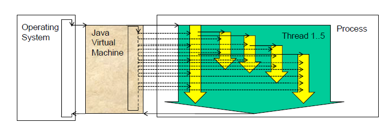

Quelle: Prof. B. Steinbach, Vorlesung „Verteilte Software“

### MPI

MPI (Message Passing Interface) - ein standardisiertes Kommunikationsprotokoll um Daten zwischen Prozessen auszutauschen

- ermöglicht den (häufigen) Austausch von Nachrichten zwischen mehreren Prozessen, die entweder auf demselben Computer oder auf verschiedenen Rechnern in einem Cluster laufen,
- ist plattformunabhängig und funktioniert auf vielen verschiedenen Computerarchitekturen,
- skalierbar (wird in Anwendungen verwendet, die auf Tausenden von Prozessoren laufen können)
- jeder beteiligter Prozess hat seinen eigenen Speicherbereich

- C, C++ und Fortran unterstützen MPI umfassend und native, greifen direkt auf Hardware
- Python ist beliebt aufgrund der Einfachheit von mpi4py.
- Java verfügt über keine native MPI-Unterstützung, aber es gibt mehrere MPI-Erweiterungen für Java z.B. MPJ Express
- R, Rust und andere haben ebenfalls MPI-Schnittstellen, allerdings meist als Wrapper um bestehende Implementierungen. 
Nachteile von nicht native Implementierungen: Leistungseinbußen (höhere Latenzzeiten und Speicherverbrauch), begrenzter Funktionsumfang (Rust), eingeschränkte Kontrolle über Speicher und Ressourcen, Anhängigkeit von Laufzeitumgebung

```cpp
//Berechnen der Summe einer großen Liste von Zahlen
// created by ChatGPT
int main(int argc, char** argv) {
    MPI_Init(&argc, &argv);
    // MPI-Variablen
    int rank, size;
    MPI_Comm_rank(MPI_COMM_WORLD, &rank);  // Den Rang (Nummer) des Prozesses erhalten
    MPI_Comm_size(MPI_COMM_WORLD, &size);  // Die Anzahl der Prozesse erhalten
    // MPI_COMM_WORLD - Kommunikationskontext (Kommunikator)

    int N = 1000000;  // Die Anzahl der Elemente
    int *data = NULL;
    int local_sum = 0, total_sum = 0;

    // Der Root-Prozess (Rank 0) initialisiert das Array mit den Daten
    if (rank == 0) {
        data = (int*)malloc(N * sizeof(int));
        for (int i = 0; i < N; i++) {
            data[i] = i + 1;  // Füllen des Arrays mit Werten von 1 bis N
        }
    }

    // Teilen der Arbeit: Jeder Prozess erhält eine Anzahl von Elementen
    int elements_per_proc = N / size;
    int* sub_data = (int*)malloc(elements_per_proc * sizeof(int));

    // Scatter: Verteilen der Daten an alle Prozesse
    MPI_Scatter(data, elements_per_proc, MPI_INT, sub_data, elements_per_proc, MPI_INT, 0, MPI_COMM_WORLD);

    // Jeder Prozess berechnet die Teilsumme
    for (int i = 0; i < elements_per_proc; i++) {
        local_sum += sub_data[i];
    }

    // Reduce: Alle Teilsummen werden zum Root-Prozess gesendet und summiert
    MPI_Reduce(&local_sum, &total_sum, 1, MPI_INT, MPI_SUM, 0, MPI_COMM_WORLD);

    // Der Root-Prozess gibt die Gesamtsumme aus
    if (rank == 0) {
        printf("Die Gesamtsumme ist: %d\n", total_sum);
        free(data);  // Freigeben des Speichers
    }

    // Speicher freigeben
    free(sub_data);
    
    MPI_Finalize();
    return 0;
}
//open-mpi:
//mpicc -o mpi_sum mpi_sum.c
//mpirun -np 4 ./mpi_sum
```

```cpp
int MPI_Scatter(
    const void *sendbuf,   // Zeiger auf das Sendedaten-Array 
    int sendcount,         // Anzahl der El., die an jeden Prozess gesendet werden
    MPI_Datatype sendtype, // Datentyp der Sendedaten
    void *recvbuf,         // Zeiger auf den Puffer für die
                           // empfangenen Daten
    int recvcount,         // Anzahl der Elemente, die jeder
                           // Prozess empfängt
    MPI_Datatype recvtype, // Datentyp der empfangenen Daten
    int root,              // Rank des Root-Prozesses
    MPI_Comm comm          // Kommunikator, der alle beteiligten Prozesse enthält
);
```

## Klasse Thread

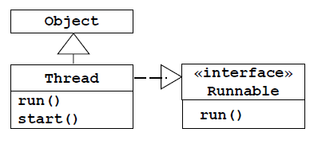

Konstruktoren (8):

```java
Thread()
Thread(Runnable target, String name)
```

Methoden:

**run()** 	    in den abgeleitenen Klassen unbedingt zu implementieren

**start()**	    startet Thread

**join()** 	    der aufrufende Thread lässt auf sich warten

**interrupt()**  beendet die Ausführung vorzeitig

	      **Achtung:** Direkter Abbruch von außen nicht möglich 

**isInterrupted()** fragt ab, ob Thread angehalten werden soll

**isAlive()**     fragt ab, ob Thread bereits läuft

**getState()**    Abfrage des Zustandes 

**sleep()**	     versetzt in den Zustand TIMED_WAITING (static)

**yield()**	     lässt eine Runde aus (static)

**wait()** 	     warte auf die Weckinformation durch den anderen Thread

**notify()**	 wecke einen einzelnen Thread

**notifyAll()**   wecke alle Threads


### Lebenszyklus (Zustände) eines Thread-Objektes

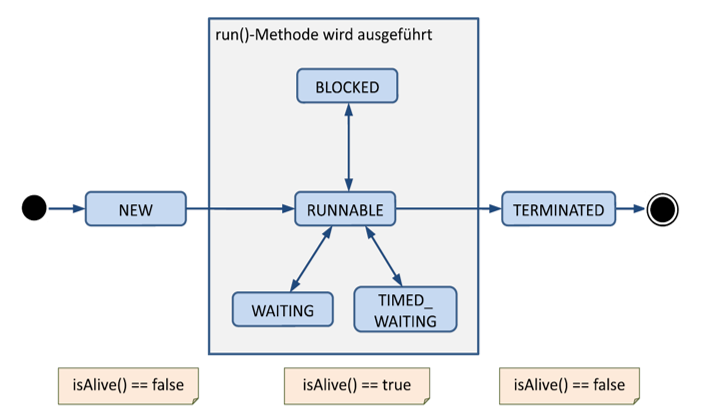

Quelle: Jörg Hettel, Manh Tien Tran: Nebenläufige Programmierung mit Java, dpunkt.verlag

Übergänge 

zum BLOCKED: synchronized

zum WAITING: Object.wait(), Thread.join(), Thread.sleep()

zum RUNNABLE: Object.notifiy(), Object.notifyAll()

### Thread erzeugen, ausführen und beenden
 
**Unterklasse definieren und run-Methode redefinieren**

```java
public class ThreadX extends Thread{
  	 public void run(){
   	// Achtung! Wenn die Methode zu Ende, 
	// ist auch Thread zu Ende
   	}
}
```

**Objekt anlegen**

```
ThreadX x=new ThreadX();
```

**Nebenläufige Ausführung der run-Methode veranlassen**

```
x.start();//warum nicht x.run()?
```

**Thread abbrechen** 

- **interrupt()**-Methode setzt Interrupt-Flag 
- **isInterrupted()** fragt Interrupt-Flag ab, direkter Abbruch nicht möglich!
- bei Verwendung von sleep und join muss InterruptException  behandelt werden

```java
public void run() {
   while ( ! isInterrupted() ) {
      System.out.println( "Und er läuft und er läuft und er läuft" );
      try {
         Thread.sleep( 500 );
      }
      catch ( InterruptedException e ) {
         interrupt();
         System.out.println( "Unterbrechung in sleep()" );
      }
   }
   System.out.println( "Das Ende" );
}

ThreadA t=new ThreadA();
t.start();
Thread.sleep( 2000 );
t.interrupt(); 
```

**auf Thread-Ende warten:**
join()-Methode

```java
Thread a = new ThreadA();
Thread b = new ThreadB();
a.start();
b.start();
a.join(); //warten auf a
b.join(); //warten auf b 
```

```java
public class MyThread extends Thread {
  private String id; //long und getId() gibt es bereits 
  public MyThread (String id) { this.id = id; }
  public void run() { 
    for (int i = 0; i < 3; i++)
        try { 
            sleep(Math.round(1000.0 * Math.random()));
            System.out.println(id +" cycle "+ i);
        }
        catch (InterruptedException e) { interrupt(); }
  }
}

public class MainThread {
    public static void main(String[] args) {
        MyThread t1, t2;
        t1 = new MyThread("t1");
        t2 = new MyThread("t2");
        t1.start();
        System.out.println("t1 " + t1.getState());
        System.out.println("t2 " + t2.getState());
        t2.start();
        System.out.println("t1 " + t1.getState());
        System.out.println("t2 " + t2.getState());    
    }
}
```
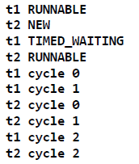

```java
 public class MyThread extends Thread {
   public void run(){ 
    try {
        int time = (int)(1000.0 * Math.random());
        sleep(time);
        System.out.println("time " + time + " ms");
    }
    catch (InterruptedException e) { 
        interrupt(); 
    }
  }
}

public class MainThread {
   public static void main(String[] args) {
        MyThread t1 = new MyThread();
        MyThread t2 = new MyThread();
        t1.start();
        t2.start();
        try { 
            t1.join();
            t2.join(); 
            }
        catch (InterruptedException e){ interrupt(); }
        System.out.println("Beide fertig");
  }
}
```

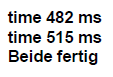

weitere Methoden:

**static Thread Thread.currentThread()** liefert den aktuellen Thread 

**final String getName()**  liefert den Namen des Threads 

**final void setName( String name )**  ändert den Namen des Threads

**final int getPriority()**  liefert die Priorität des Threads

**final void setPriority( int newPriority )**  setzt die Priorität des Threads


Default-Name: 	Thread-X

Priorität: 	MIN_PRIORITY=1 bis MAX_PRIOTITY=10, (NORM_PRIORITY=5) 	anderenfalls IllegalArgumentException

```java
ThreadNaming t1=new ThreadNaming();
ThreadNaming t2=new ThreadNaming();
System.out.println("Name of t1:"+t1.getName());
System.out.println("Name of t2:"+t2.getName());
//…
```

Name of t1: Thread-0 

Name of t2:T hread-1

### Dämonen
- erbringen Dienstleistungen 
- arbeiten im Hintergrund 

```java
setDaemon(true)
setDaemon(false)//user thread
Boolean isDaemon()
```

## Interface Runnable

```java
//Standardimplementierung in der Thread-Klasse
public void run() {
    if (target != null) {
        target.run();
    }
}

// Übergabe eines Runnable-Objekts an einen Thread
Thread thread = new Thread(new MyRunnable());
thread.start(); // Ruft die run()-Methode von MyRunnable auf
```

- wenn Basisklasse bereits vorhanden oder Nebenläufigkeit nur „vorübergehend“ benötigt wird 

```java
class Counter extends BaseClass  implements Runnable {
    @Override 
    public void run() {
        for ( int i = 0; i < 100; i++ )
            System.out.println( i );
    }
} 
```

```java
new Thread(new Runnable() {
   @Override
   public void run() {
      //TODO
   }
}).start();
```

- Runnable deklariert NUR die run-Methode 
- zum Ausführen wird zusätzlich ein Thread („Executer“) benötigt

```java
Thread t = new Thread( new Counter() );
t.start(); 
```

- Threadobjekt t verwendet beim Starten nicht die eigene run-Methode sondern die von Counter

```java
new Thread(new Runnable() {
    @Override
    public void run() {
        //TODO
    }
}).start();
```

```java
public class Entertainer {
   private String spruch="This is my favorite song: ";
   public String getSpruch(){ return spruch;
   }
}
```

```java
public class SingingEntertainer extends Entertainer implements Runnable {
   String text;

   public SingingEntertainer(String text) {
      this.text = text;
   } 
   @Override
   public void run() {
      System.out.println(getSpruch());
      while (!Thread.interrupted()){
         System.out.println(text);
         try {
            Thread.sleep((long) (Math.random()*1000));
            } catch (InterruptedException e) {
               Thread.currentThread().interrupt();
               e.printStackTrace();
            }
      }
   }
}
```

```java
public class Buehne {
   public static void main(String[] args) {
      SingingEntertainer sa1=new SingingEntertainer ("Lala");
      SingingEntertainer sa2=new SingingEntertainer ("Trala");
      Thread th1=new Thread(sa1);
      th1.start();
      Thread th2=new Thread(sa2);
      th2.start();
      try {
         Thread.sleep(2000);
      } catch (InterruptedException e) {
         Thread.currentThread().interrupt();
         e.printStackTrace();
      }
//    th1.interrupt();
//    th2.interrupt();
      System.exit(0);
   }
}
```

## Synchronisation

die Koordinierung des zeitlichen Ablaufs mehrerer nebenläufiger Prozesse bzw. Threads (in einem Programm, auf einem Computer, im verteilten System)

### Zweck: 

- zur gemeinsamen Nutzung beschränkter Ressourcen (z.B. von Peripheriegeräten)
- zur Interprozesskommunikation (Übergabe von Nachrichten zwischen den Prozessen)
- zur Steuerung von Unterprozessen, z.B. das Abbrechen von Prozessen oder das Warten darauf, dass sie terminieren.
- zur Vermeidung der Dateninkonsistenzen durch den gleichzeitigen Zugriff (Race Conditions – Wettlaufsituation)

### Synchronisation von Threads

Threads laufen im gleichen Prozess und nutzen die gleichen Daten

Bild: kritischerAbschnitt
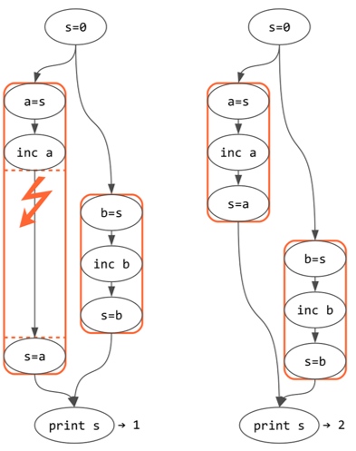
Quelle: Wikipedia - Kritischer Abschnitt (Benutzer Nomen4Omen)

**Problem:*** 
Thread-Umschaltung beim nicht atomaren  Befehlen (ist i++ atomar?)

Eine atomare Operation in Bezug auf den Datenzugriff bedeutet, dass sie entweder vollständig ausgeführt wird oder überhaupt nicht ausgeführt wird, atomare Operationen sind unteilbar und werden in einem einzigen Schritt ausgeführt.

**kein Problem:**
- bei immutable (thread-sicheren) Objekten, z.B. String
- Methoden, die keine Objekteigenschaften verändern, sondern nur lesen
- Variablen im eigenen Stack

**Kritische Abschnitte:** 
zusammenhängende Programmblöcke, die während der Ausführung nicht unterbrochen werden dürfen

### Exclusiver Lock
Nur ein Thread oder Prozess kann zur gleichen Zeit auf die Ressource zugreifen, oft Teil eines Locks-Systems

### MUTEX – Verfahren (MUTual EXclusion) – gegenseitiger Ausschluss 

- Spezielle Art von Lock: Synchronisationsobjekt, das exklusiven wechselseitigen Zugriff auf eine Ressource sicherstellt
- in der Regel eine Variable, die auf "gesperrt" (locked) oder "frei" (unlocked) gesetzt wird
- geeignet, wenn es nur darum geht, den exklusiven Zugriff auf eine Ressource oder einen Abschnitt des Codes zu gewährleisten 

### Semaphore

- steuern (wie mechanische Eisenbahnsignale) den parallelen Zugriff auf eine Ressource 
- vielseitiger als Mutexe und können steuern
    - sowohl den exklusiven Zugriff auf eine Ressource (binäre Semaphore) 
    - als auch den gleichzeitigen Zugriff auf begrenzte, zählbare Ressourcen (allgemeine Semaphore) 
- bestehen aus einer Datenstruktur mit Initialisierungs- und zwei atomaren Nutzungsoperationen
- realisieren ein passives Warten der Prozesse, wenn eine Weiterausführung nicht gestattet werden kann 
- eine Implementierung der Semaphor-Mechanismen ist konzeptionell im Betriebssystem anzusiedeln
- Vorteil: können verwendet werden um komplexe Szenarien zu steuern, Nachteil: hohe Fehleranfälligkeit

**Lösung von Dijkstra, 1965**:

- Datenstruktur besteht aus einem Zähler und einer Warteschlange
- Initialisierungsoperation: der Zähler wird auf einen nicht negativen Wert nitialisiert und die Warteschlange auf leer gesetzt 
- **P-Operation** (*probeer te verlagen – versuche zu senken*): der Zähler wird dekrementiert, ist der Zähler jedoch kleiner als 0 wird der aufrufende Prozess blockiert  und der Warteschlange hinzugefügt 
- **V-Operation** (*verhogen - erhöhen*): der Zähler wird inkrementiert. Ein Prozess wird aus der Warteschlange, falls sie nicht leer ist,  entnommen und setzt die Ausführung fort.

https://de.wikipedia.org/wiki/Semaphor_(Informatik)

### Monitore (um 1973)

- ein Mechanismus zur Synchronisierung von Threads auf einer höhere Abstraktionsebene, z.B. integriert in Programmiersprachen
- eine abstrakte Datenstruktur oder ein spezielles Programmierkonzept
- erlauben normalerweise ähnlich wie bei Mutex nur einem Thread zu gleicher Zeit den Zugriff auf Monitorbereich (Methode oder den Codeblock)
- ermöglichen es, auf eine bestimmte Zustandsänderung zu warten und blockierte Threads zu benachrichtigen, sobald die gewünschte Änderung eintritt
- sind somit komplexer als die einfache binäre Sperre, die durch Mutexe bereitgestellt wird 
- die Implementierungen sind sicherer und Verwendung verständlicher (als Semaphore)

### Übersicht 

| Mechanismus | Exklusiver Zugriff | Mehrere gleichzeitige Zugriffe | Prozess- übergreifend | Komplexität und Overhead im Bezug auf Implementierung und Verwendung |
| --------------- | ---- | ---- | ---- | ----------- |
| Exklusiver Lock | Ja | Nein | Nein | Leicht |
| Mutex | Ja | Nein | Ja | Schwer |
| Monitor | Ja | Nein | Nein | Leicht |
| Semaphore | Ja | Ja | Ja | Variiert |

### Java-Monitor

**Funktionsweise:**

Kapselung eines kritischen Bereiches (nicht zwingend ein Objekt)

- Synchronisationsprimitive werden automatisch vom Compiler erzeugt und  von JVM ggf. optimiert und ausgeführt
- bei Betreten des Bereiches wird eine Sperre gesetzt, beim Verlassen des Bereichs wird die Sperre zurückgenommen
- über wait/notify werden Threads in Wartezustand versetzt bzw. geweckt

**Java-Konstrukte:**

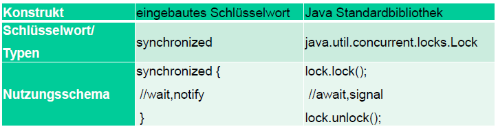

**synchronized**

**Block:**

```java
synchronized(objekt){ /*…*/} 
```

ein Block mit expliziten Angabe eines zu sperrenden Objektes

**Methode:**

```java
synchronized Typ name (Parameter){ /*…*/} 
//eine Methoden (Sperre auf this-Objekt)
```

```java
public class Daten{
    //…
    public synchronized void method(){
	//…
    }
}

```

eine Methoden (Sperre auf this-Objekt)

- Hat ein Thread den Monitor-Bereich betreten, sorgt JVM dafür, dass andere Threads warten
- ist beim Eintritt in den Monitor die Sperre bereits gesetzt, hat das aktuelle Thread zu warten bis der Konkurrent die Sperre frei gibt

> Ein Thread fragt einen anderen: „Hast du schon gehört, dass unser Code jetzt thread-sicher ist?“
> Der andere Thread: „Oh, das erklärt, warum er so langsam geworden ist!“


```java
public class Daten {
    public int mehr, weniger, summe;
}

public class MainThread {
    public static void main(String[] args) {
        Daten daten = new Daten();
        daten.mehr = 0; 
        daten.weniger = 33;
        ThreadX x = new ThreadX(daten);
        ThreadY y = new ThreadY(daten);
        x.start();
        y.start();
    }
}

public class ThreadX extends Thread {
    Daten daten;

    ThreadX(Daten d) { 
        daten = d; 
    }
    public void run() {
        for(int i = 0; i < 10; i++) {
         synchronized(daten) {
            try {	
	    daten.mehr++;
	    Thread.sleep(200);
              daten.weniger--;
              Thread.sleep(200);
	    daten.summe = daten.mehr + daten.weniger;
              System.out.printf("x: %2d + %2d = %2d%n", 
                                           daten.mehr, daten.weniger, daten.summe);
           }
           catch(InterruptedException e) {
              interrupt();
           }
        }
       Thread.yield();
     }
   }
}
public class ThreadY extends Thread {
    Daten daten;

    ThreadY(Daten d) { 
        daten = d; 
    }
    public void run() {
        for(int i = 0; i < 10; i++) {
          synchronized(daten) {
             try {
                System.out.printf("y: %2d + %2d = %2d%n", 
                               daten.mehr, daten.weniger, daten.summe);
 	      Thread.sleep(200);
             }
             catch(InterruptedException e) {
               interrupt();
             }
         }
         Thread.yield();
      }
    }
}
```
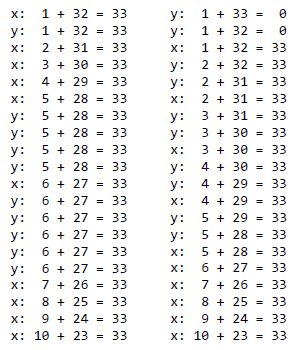

Ein gesperrtes Objekt besitzt zusätzlich zur Sperre eine Warteliste

**wait**, **notify** - Methoden der Klasse Object

nur innerhalb eines synchronized-Blockes erlaubt!

| Methode   | Bedeutung                                                                     |
| --------- | ----------------------------------------------------------------------------- |
| wait      | versetzt den aktuellen Thread in den Zustand wartend                          |
| notify    | weckt einen Thread, der auf Objekt wartet und ändert sein Zustand in runnable |
| notifyAll | benachrichtigt alle wartende Threads                                          |

### Das Erzeuger-Verbraucher-Problem (producer consumer problem)

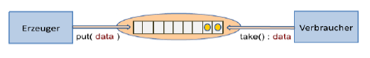

Quelle: Prof. B. Steinbach, Vorlesung „Verteilte Software“

> PCP - ist eine klassische, abstrakt formulierte Problemstellung der Prozesssynchronisation - Wikipedia

+ auch als Produzent-Konsument-Problem bekannt 
+ beschreibt die Interaktion zwischen zwei Prozessen einem Erzeuger (Produzent), der Daten erzeugt, und einem Verbraucher (Konsument), der diese Daten verarbeitet
+ beide Prozesse teilen sich einen gemeinsamen Puffer, der eine begrenzte Kapazität hat. Der Erzeuger muss warten, wenn der Puffer voll ist, und der Verbraucher muss warten, wenn der Puffer leer ist. 
 
 ```java 
 //Idee: Prof. B. Steinbach, Vorlesung „Verteilte Software“
 
public class Main_Thread {
   static public void main(String args[])
   {
      Behaelter behaelter=new Behaelter(200);

      Thread thread[] = new Thread [5];
      thread[0] = new ZuThread(behaelter, 70, 100);
      thread[1] = new ZuThread(behaelter, 40, 300);
      thread[2] = new ZuThread(behaelter, 30, 600);
      thread[3] = new AbThread(behaelter, 50, 500);
      thread[4] = new AbThread(behaelter, 90, 200);
      for (int i = 0; i < thread.length; i++) 
        thread[i].start();
   }
}

public class ZuThread extends Thread {
   Behaelter b; 
   int menge, intervall;

   public void run() { 
      for (int i=0;i<3;i++) { 
         try {
            sleep(intervall);
            b.zu(menge);
         } catch (InterruptedException e) {} 
      }
   }
   //Konstruktor
}

public class AbThread extends Thread{
   Behaelter b; 
   int menge, intervall;

   public void run() { 
      for (int i=0;i<2;i++) { 
         try {
            sleep(intervall);
            b.ab(menge);
         } catch (InterruptedException e) {} 
      }
   }
   //Konstruktor
}

public class Behaelter {
   private int max, level;

   Behaelter(int max) { 
      this.max = max;
      level = 0;
   }

   synchronized void zu(int x) throws InterruptedException { 
      while ((level + x) > max) wait();
      level += x;
      System.out.println("zu "+ x + " level "+ level);
      notifyAll();
   }
   synchronized void ab(int x) throws InterruptedException { 
      while ((level - x) < 0) wait(); 
      level -= x;
      System.out.println("ab "+ x + " level "+ level);
      notifyAll();
   }
}
```

```
zu 70 level 70
zu 70 level 140
ab 90 level 50
zu 40 level 90
zu 70 level 160
ab 90 level 70
ab 50 level 20
zu 30 level 50
zu 40 level 90
zu 40 level 130
ab 50 level 80
zu 30 level 110
zu 30 level 140
```

### Lock

Interface Lock, Klasse ReentrantLock

Interface Condition

Paket: java.util.concurrent.locks

```
Methoden: (interface Lock) void lock()
	markiert der Anfang des kritischen Blocks, blockiert bis der Lock frei ist
boolean tryLock()
	wartet nicht, kehrt mit einem false zurück
boolean tryLock(long time, TimeUnit unit) throws InterruptedException
	wartet die angegebene Zeitspanne
void unlock() 
	verlässt den kritischen Block
Condition newCondition()
	liefern ein Condition-Objekt zum Aufrufen von await und signal
```

Methoden des interface Condition

versetzen in Zustand wartend:

```
public void await() throws InterruptedException
public boolean await(long time, TimeUnit unit)
				throws InterruptedException
public boolean awaitUntil(Date deadline)
				throws InterruptedException
```

wecken:  

```
public void signal()
public void signalAll()
```

### ReadWriteLock-Konzept

unterscheidet zwischen lesenden und schreibenden Zugriffen (Sperren zum Lesen und Schreiben)

interface ReadWriteLock:

```
public Lock readLock()
public Lock writeLock()
```

```java
import java.util.concurrent.locks.Condition; 
import java.util.concurrent.locks.ReentrantLock; 

//Erzeugung
static ReentrantLock lock=new ReentrantLock();
static Condition condition=lock.newCondition();


lock.lock();
try
{
   //Ein kritischer Abschnitt
   if (…) condition.await();
   else condition.signalAll();
}
finally
{
   lock.unlock();
}

void zu(int x) throws InterruptedException { 
   lock.lock();
   while ((level + x) > max) condition.await(); 
   level += x;
   System.out.println("zu "+ x +" level "+ level);
   condition.signalAll();   
   lock.unlock();
}

void ab(int x) throws InterruptedException { 
   lock.lock();
   while((level - x) < min)  condition.await();    
   level -= x;
   System.out.println("ab "+ x +" level "+ level);
   condition.signalAll();
   lock.unlock();
}
```

Beispiel: Raucherproblem

```java
import java.util.concurrent.locks.Condition;
import java.util.concurrent.locks.Lock;
import java.util.concurrent.locks.ReentrantLock;
public class RaucherProblem {
   static final Lock lock = new ReentrantLock();
   static final Condition tobacco = lock.newCondition();
   static final Condition paper = lock.newCondition();
   static final Condition matches = lock.newCondition();
   static boolean isTobacco = false;
   static boolean isPaper = false;
   static boolean isMatches = false;

   public static void main(String[] args) {
      Thread agentThread = new Thread(new Agent()); //legt zwei Zutaten auf den Tisch.
      Thread smoker1 = new Thread(new Smoker("Tabak", tobacco, paper, matches));
      Thread smoker2 = new Thread(new Smoker("Papier", paper, matches, tobacco));
      Thread smoker3 = new Thread(new Smoker("Streichhölzer", matches, tobacco, paper));
      agentThread.start();
      smoker1.start();
      smoker2.start();
      smoker3.start();
   }
}

//Agent wählt zufällig zwei Zutaten aus und legt sie auf den Tisch.
//signalisiert die entsprechende Condition, 
//damit der entsprechende Raucher aufwachen kann.

public class Agent implements Runnable {
   @Override
   public void run() {
         try {
            while (true) {
               RaucherProblem.lock.lock();
               try {
                  switch ((int) (Math.random() * 3)) {
                     case 0:
                        RaucherProblem.isTobacco = true;
                        RaucherProblem.isPaper = true;
                        System.out.println("Agent legt Tabak und Papier auf den Tisch.");
                        RaucherProblem.matches.signal();
                        break;
                     case 1:
                        RaucherProblem.isTobacco = true;
                        RaucherProblem.isMatches = true;
                        System.out.println("Agent legt Tabak und Streichhölzer auf den Tisch.");
                        RaucherProblem.paper.signal();
                        break;
                     case 2:
                        //analog
                  }
               } finally {
                  RaucherProblem.lock.unlock();
               }
                  Thread.sleep(1000); // Simuliert die Zeit zum Zutaten platzieren
            }
         } catch (InterruptedException e) { }
   }
}

//Jeder Raucher hat eine spezifische Zutat und 
//wartet auf die beiden anderen Zutaten.
//Wenn die Bedingungen erfüllt sind, 
//kann der Raucher rauchen.
//danach setzt der Raucher die Zustände der Zutaten zurück 

import java.util.concurrent.locks.Condition;
public class Smoker implements Runnable {
   private final String ingredient;
   private final Condition myCondition;
   @Override
   public void run() {
      try {
         while (true) {
            RaucherProblem.lock.lock();
            try {
               while (!canSmoke()) myCondition.await();
               System.out.println("Raucher mit " + ingredient + " raucht.");
               resetIngredients();
            } finally {
               RaucherProblem.lock.unlock();
            }
            Thread.sleep(1000); // Simuliert das Rauchen
         }
      } catch (InterruptedException e) {
         e.printStackTrace();
      }
   }

   public Smoker(String ingredient, Condition myCondition) {
      this.ingredient = ingredient;
      this.myCondition = myCondition;

   }

   private boolean canSmoke() {
      switch (ingredient) {
         case "Tabak":
            return RaucherProblem.isPaper && RaucherProblem.isMatches;
         case "Papier":
            return RaucherProblem.isTobacco && RaucherProblem.isMatches;
         case "Streichhölzer":
            return RaucherProblem.isTobacco && RaucherProblem.isPaper;
         default:
            return false;
      }
   }

   private void resetIngredients() {
      RaucherProblem.isTobacco = false;
      RaucherProblem.isPaper = false;
      RaucherProblem.isMatches = false;
   }
}
```

### Klasse Semaphore

```
public class Semaphore extends Object implements Serializable
```

- Semaphore(int permits, boolean fair)
- void acquire(): versucht, in den kritischen Block einzutreten, wartet, wenn der gerade belegt ist, wird gewartet, vermindert die Menge der Erlaubnisse um eins.
- void release(): verlässt den kritischen Abschnitt und legt eine Erlaubnis zurück.

**Fairness**: mit einer fairen Semaphore wird verhindert, dass Threads verhungern, in dem sie sicherstellt, dass die Threads in der Reihenfolge des Ankommens bedient werden.

```java
public class SaunaSimulation {
   public static void main(String[] args) {
      int personId = 0;

      while (true) {
         new Thread(new SaunaVisitor(personId++)).start();
         try {
         // Zufälliger Zeitabstand zwischen den Personen
         Thread.sleep((long) (1000 + Math.random() * 4000));
         } catch (InterruptedException e) {
            Thread.currentThread().interrupt();
            System.out.println("Thread wurde unterbrochen.");
         }
      }
   }
}

import java.util.concurrent.Semaphore;
public class SaunaVisitor implements Runnable {
   private static final int SAUNA_CAPACITY = 6; 
   private static final int NUM_VISITS = 3; 
   private static final int VISIT_INTERVAL = 10* 60 * 1000;
   private static final int SAUNA_DURATION = 5* 60 * 1000;

   private static final Semaphore saunaSemaphore = new Semaphore(SAUNA_CAPACITY, true);
   private int personId;
   public SaunaVisitor(int personId) {
      this.personId = personId;
   }

   @Override
   public void run() {
      try {
       for (int visit = 0; visit < NUM_VISITS; visit++) {   
         saunaSemaphore.acquire(); // Warten, bis ein Sitzplatz frei ist
         System.out.println(personId + " betritt die Sauna " + (visit + 1) + ".");
         Thread.sleep(SAUNA_DURATION);
         System.out.println(personId + " verlässt die Sauna " + (visit + 1) + ".");
         saunaSemaphore.release(); // Freigeben des Sitzplatzes
         Thread.sleep(VISIT_INTERVAL);
         }
      } catch (InterruptedException e) {
         Thread.currentThread().interrupt();
         System.out.println(personId + " wurde unterbrochen.");
      }
   }
}
```


### Deadlock

> Wikipedia: Deadlock oder Verklemmung bezeichnet in der Informatik einen Zustand, bei dem eine zyklische Wartesituation zwischen mehreren Prozessen auftritt, wobei jeder beteiligte Prozess auf die Freigabe von Betriebsmitteln wartet, die ein anderer beteiligter Prozess bereits exklusiv belegt hat.

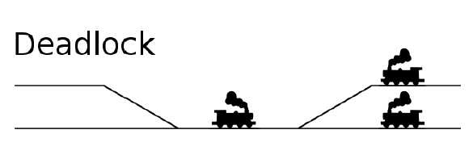

Quelle: https://www.wikiwand.com/de/Deadlock_(Eisenbahn)

Beispiele: 

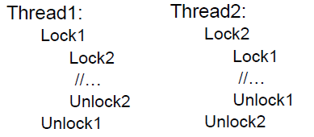

Lösung: die gleiche Reihenfolge von Sperren

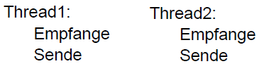

Lösung: Thread2:
		Sende
		Empfange


**Philosophenproblem**

Die Philosophen sitzen am Tisch und denken über philosophische Probleme nach. Wenn einer hungrig wird, greift er zuerst die Gabel links von seinem Teller, dann die auf der rechten Seite und beginnt zu essen. Sollte eine Gabel nicht an ihrem Platz liegen, so wartet er, bis die Gabel wieder verfügbar ist. 
Wenn alle gleichzeitig ihre linke Gabel greifen und damit Kollegen dessen rechte Gabel wegnehmen, legt keiner ihre Gabel zurück. Die Philosophen verhungern. 

Lösung mittels Ressourcenhierarchie:

Die Gabeln werden von eins bis fünf durchnummeriert. Jeder Philosoph muss immer zuerst versuchen, die Gabel mit der niedrigeren Nummer aufzunehmen, und nur wenn das erfolgreich war, versucht er, die Gabel mit der höheren Nummer aufzunehmen.
Alternative Lösung besteht darin, dass jeder hungrige Philosoph entweder beide Gabeln gleichzeitig, oder keine Gabeln aufnehmen darf.


Quelle: Benjamin D. Esham / Wikimedia Commons
An illustration of the dining philosophers problem. Philosophers clockwise from top - Plato, Konfuzius, Socrates, Voltaire and Descartes.


Quelle: https://de.wikipedia.org/wiki/Datei:An_illustration_of_the_dining_philosophers_problem.png

```java
class Philosoph implements Runnable {
  private final Lock linkeGabel;
  private final Lock rechteGabel;

  Philosoph(int id, Lock linkeGabel, Lock rechteGabel) {
     // verteilt die Gabeln in aufsteigender Reihenfolge
  }
  @Override
  public void run() {
    try {
        while (!Thread.interrupted()) {
           denken();
           linkeGabel.lock(); // nimmt zuerst die Gabel mit der niedrigeren Nummer auf
           try {
              rechteGabel.lock();
              try {
                  essen();
              } finally { rechteGabel.unlock();
              }
           } finally { linkeGabel.unlock();
           }
        }
    } catch (InterruptedException e) { }
  }

class PhilosophenProblem {
   private static final int ANZAHL_PHILOSOPHEN = 5;
   private static final Philosoph[] philosophen = new Philosoph[ANZAHL_PHILOSOPHEN];
   private static final Lock[] gabeln = new ReentrantLock[ANZAHL_PHILOSOPHEN];
   //…
} 
```

### Thread-sichere Container

- synchronized-geschützte Container: Vector, Stack, HashTable und Dictionary

- synchronisierte Hüllklassen (Wrapper), static-Methoden zum „Einhüllen“

```
   List<Person> liste = new ArrayList<Person>();
   List<Person> syncListe = Collections.synchronizedList(liste);

   Map<String,String> map = new HashMap<String,String>();
   Map<String,String> syncMap = Collections.synchronizedMap(map);
```

- Klasse Collections bietet die unmodifiable-Methoden für bestehende Collections, die nur „View-Sicht“ erlauben

- Concurrent-Collections (hier eine Auswahl), die unterschiedliche Sicherungsalgorithmen für alle üblichen Container, implementieren

Paket : java.util.concurrent 

List: 
	CopyOnWriteArrayList

Set: 
	CopyOnWriteArraySet

Map: 
	Interface ConcurrentMap,  
	Implementierungen
		ConcurrentHashMap

Queue:
	Interface BlockingQueue 
	Implementierungen
        ArrayBlockingQueue, LinkedBlockingQueue

CopyOn-Collections: die Änderungen an eine Kopie, das atomare Ersetzen

ArrayBlockingQueue:

- interne Speicherung im Array
- Synchronisation haupsächlich über ReentrantLock und Condition-Objekt
- Verwendung von atomaren Operation der Klasse AtomicInteger auf Indexwerte im Array (java.util.concurrent.atomic enthält weitere atomare Operation/Klassen)

- ConcurrentHashMap: Hashbereich wird in mehrere Lock-Bereiche aufgeteilt

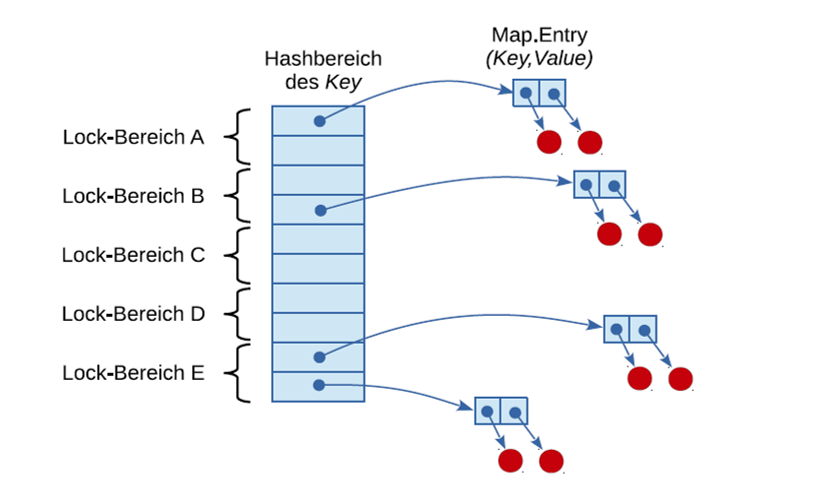

Quelle: Jörg Hettel, Manh Tien Tran: Nebenläufige Programmierung mit Java, dpunkt.verlag

Beispiel:
Transaktionssystem, das aus einem Produzenten und einem Konsumenten besteht, die Transaktionen zwischen Konten simulieren.
Der TransactionConsumer nimmt und verarbeitet Transaktionen aus der Warteschlange (ArrayBlockingQueue), der
TransactionProducer produziert Transaktionen und fügt sie der Warteschlange hinzu.


```java
public class Transaction {
   public int from;
   public int to;
   public double amount;

   public Transaction(int from, int to, double amount) {
      this.from = from;
      this.to = to;
      this.amount = amount;
   }
}

public class TransactionConsumer extends Thread {
   public ArrayBlockingQueue<Transaction> transactionQueue;

   public TransactionConsumer(ArrayBlockingQueue<Transaction> transQueue){
      this.transactionQueue = transQueue;
   }

   public void run() {
      while (!isInterrupted()){
         try {
            Transaction transaction=transactionQueue.take();
      double betrag=transaction.amount;
      int von=transaction.from;
      int zu=transaction.to;
      System.out.println(betrag+" "+von+" -> "+zu);
	   } catch (InterruptedException e) {
	         Thread.currentThread().interrupt();
         }
      }
   }
}

public class TransactionProducer {
   public static void main(String[] args) {
      ArrayBlockingQueue<Transaction> transactionQueue= new ArrayBlockingQueue<Transaction>(100);
      TransactionConsumer bank=new TransactionConsumer(transactionQueue);
      transactionQueue.add(new Transaction(1,2,100));
      transactionQueue.add(new Transaction(1,3,200));
      transactionQueue.add(new Transaction(1,4,100));
      bank.start();

      Scanner eingabe=new Scanner(System.in);
      double betrag=eingabe.nextDouble();
      while (betrag>0){
	      int from=eingabe.nextInt();
	      int to=eingabe.nextInt();
	      transactionQueue.add(new Transaction(from,to,betrag));
	      betrag=eingabe.nextDouble();
      }
      eingabe.close();
   }
}
```

### Klasse Thread als Service (Wiederholung)

```java
public class MyRunnable implements Runnable
{
   public MyRunnable() { }
   @Override
   public void run() {
      //...
   }
}

public class MainRunClass
{
   public static void main(String[] args) {
      //...
      MyRunnable myRunnable = new MyRunnable();
      Thread thread = new Thread(myRunnable);
      myThread.start();
      //...
   }
}
```

### Threadpool

- häufig sind die Aufgaben nicht von sehr langer Dauer
- viele einzelne Threads belasten Betriebssystem

Lösung: Threadpools, die eine bestimmte Anzahl von Threads verwalten

- bekommen Runnable (Callable) - Objekt übergeben
- je nach Art des Pools wird das Objekt sofort einem Thread zugeteilt oder erst in eine Queue gestellt 
- wenn das Runnable ausgeführt wurde, kann Threadpool weitere noch wartende Aufgaben übernehmen 

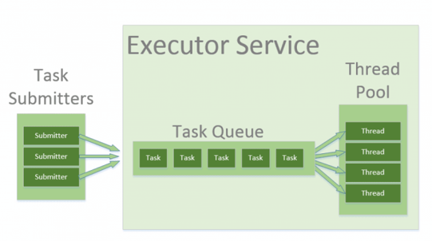

Quelle: https://www.baeldung.com/thread-pool-java-and-guava


Paket java.util.concurrent 

Interfaces (einige)
- Executor – Abstraktion aller Klassen, die Runnable-Tasks ausführen
        void execute(Runnable command)
- ExecutorService – stellt zusätzlich submit-Methode und weitere Methoden zur Verfügung

```
void shutdown()
Future<V> submit(Callable<V> task)
Future<?> submit(Runnable task) – future.get() liefert null 
und weitere
 
Callable<V> - ein Task mit Ergebnis und Exception
V call() throws Exception

Future<V> - repräsentiert das Ergebnis einer (asynchronen) Ausführung
V get()
V get(long timeout, TimeUnit unit)
boolean isCancelled()
boolean cancel(boolean mayInterruptIfRunning)
boolean isDone()
```

```
\\Exceptions
CancellationException - if the computation was cancelled
ExecutionException - if the computation threw an exception
InterruptedException - if the current thread was interrupted while waiting
TimeoutException - if the wait timed out
IllegalStateException - if the task has not completed or the task did not complete with a result 
```

https://docs.oracle.com/en/java/javase/23/docs/api/java.base/java/util/concurrent/Future.html


### Runnable vs. Callable

beides sind Interfaces und haben nur eine Methode
aber Callable.call liefert ein Ergebnis und wirft Exception

```java
public interface Runnable { 
	public void run(); 
} 

public interface Callable<V>{
 	public V call() throws Exception; 
} 
```

Paket java.util.concurrent 

Class
Executors – Factory- und Utility-Methoden für Interfaces und Klassen des Pakets, z.B.

Die Methoden zum Erzeugen von ExecutorService-Objekten mit verschiedenen Konfigurationen:

```
static ExecutorService newSingleThreadExecutor():
		erzeugt ein Service, der genau einen Thread startet
static ExecutorService newCachedThreadPool():
		erzeugt einen Thread-Pool mit wachender Größe
static ExecutorService newFixedThreadPool(int nThreads)
		erzeugt ein Thread-Pool mit maximale Thread-Anzahl und einer Warteschlange
und weitere
```

Interface ExecutorService als Service für Runnable

```java
import java.util.concurrent.Executors;
import java.util.concurrent.ExecutorService;

public class MainRunClass
{
   public static void main(String[] args){
      //...
      MyRunnable myRunnable = new MyRunnable();
      ExecutorService singleThreadExecutor = 
			Executors.newSingleThreadExecutor();
      singleThreadExecutor.execute(myRunnable);
      singleThreadExecutor.shutDown();
      //ein ExecutorService ist zu beenden, 
      //sonst wartet er auf weitere Runnables 
      //...
   }
}
```

Interface ExecutorService als Service für Callable

```java
import java.util.concurrent.Callable;

public class MyCallable implements Callable<String>
{
   public MyCallable(){
   }

   @Override
   public String call() {
      // Antwort auf die "endgültige Frage nach dem Leben, dem Universum und dem ganzen Rest"
      return "42";
   }
}
```

```java
import java.util.concurrent.Future;
import java.util.concurrent.Executors;
import java.util.concurrent.ExecutorService;
import java.util.concurrent.ExecutionException;

public class MainCallClass {
   public static void main(String[] args) {
      //...
      ExecutorService exec = Executors.newSingleThreadExecutor();
      Future<String> future = exec.submit(new MyCallable());

      try {
         System.out.println(future.get());
         // get blockiert, bis das Ergebnis zur Verfügung steht!
      }
      catch(InterruptedException | ExecutionException ex) {
         ex.printStackTrace();
      }
      exec.shutdown();
      //...
   }
}
```

```java
import java.util.concurrent.Callable;

public class SumCallable implements Callable<Long> {
    private long untereGrenze, obereGrenze;

    public Long call() throws Exception {
        long sum=0;
        for (long i=untereGrenze;i<obereGrenze;i++) sum+=i;
        Thread.sleep(1000);
        return sum;
    }
    public SumCallable(long untereGrenze, long obereGrenze) {
        super();
        this.untereGrenze = untereGrenze;
        this.obereGrenze = obereGrenze;
    }
}
```

```java
import java.util.concurrent.Future;
import java.util.concurrent.Executors;
import java.util.concurrent.ExecutorService;
import java.util.concurrent.ExecutionException;

public class SumMain{
   public static void main(String[] args) {
      ExecutorService exec = Executors.newFixedThreadPool(10);
      Future<Long> future1 = exec.submit(new SumCallable(100,1000));
      Future<Long> future2 = exec.submit(new SumCallable(1001,10000));
      try {
         System.out.println(future1.get()+future2.get());

      }
      catch(InterruptedException | ExecutionException ex) {
         ex.printStackTrace();
      }
      exec.shutdown();
   }
}
```
Literatur:

Christian Ullenboom : Java ist auch eine Insel , Rheinwerk

Jörg Hettel, Manh Tien Tran: Nebenläufige Programmierung mit Java, dpunkt.verlag

https://docs.oracle.com/en/java/javase/23/docs/api/java.base/java/util/concurrent/package-summary.html

http://www.straub.as/java/threads/
